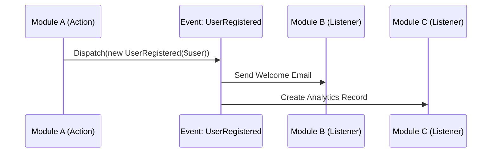

# Laravel Architecture Patterns

Standardized patterns for building isolated and scalable modular applications.

## Gotchas
- **Circular Dependencies:** Avoid Module A needing Module B while Module B needs Module A. If this happens, extract the shared logic into a `Core` module or `app/` layer.
- **Event Bloat:** Don't dispatch events for trivial internal logic. Use them for cross-module side effects.
- **Fat Services:** Services should orchestrate, not contain every single line of logic. Use Actions for specific units of work.

## 1. Cross-Module Communication
Maintain strict module boundaries to allow future extraction into microservices.

### Pattern: Synchronous (Contracts)
Use when Module A needs a result from Module B immediately.

```php
// app/Contracts/Modules/PricingContract.php
interface PricingContract {
    public function calculate(Order $order): int;
}

// Modules/Pricing/Services/PricingService.php (Implementation)
final readonly class PricingService implements PricingContract {
    public function calculate(Order $order): int { ... }
}

// In Module A
public function __construct(private PricingContract $pricing) {}
```

### Pattern: Asynchronous (Events)
Use for decoupled side effects.



## 2. Action-Payload Orchestration
Use Domain Services to coordinate multiple Actions or external integrations.

```php
final readonly class CheckoutService
{
    public function __construct(
        private ValidateStockAction $validateStock,
        private CreateOrderAction $createOrder,
        private PaymentContract $payment,
    ) {}

    public function handle(CheckoutPayload $payload): Order
    {
        return DB::transaction(function () use ($payload) {
            $this->validateStock->handle($payload->items);
            $order = $this->createOrder->handle($payload->toOrderPayload());
            $this->payment->charge($order, $payload->paymentDetails);

            return $order;
        });
    }
}
```

## 3. The "Optional Module" Concept
Design modules to be pluggable. A module should be able to be added or removed by simply adding/removing its Service Provider registration and its folder.

## Constraints
- **MUST** enforce the "Zero-Cross Model Import" law.
- **MUST** use `final readonly` for all pattern-related classes.
- **MUST** read `references/modular-ddd.md` for deep architectural theory if required.
