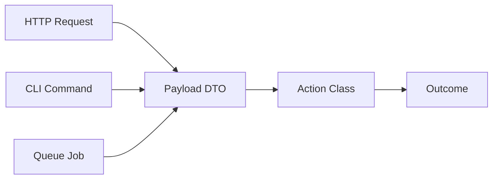
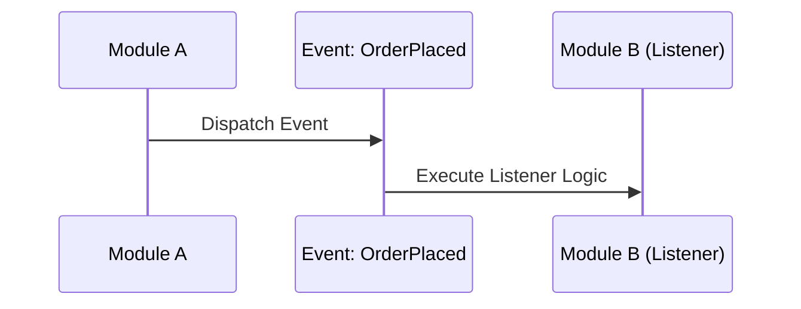

# Laravel Architecture Patterns

Production-grade patterns for building clean, isolated, and scalable modular applications.

## 1. The Action-Payload Pattern
Decouple your business logic from the transport layer (HTTP, CLI, Jobs).



### Implementation Checklist
- [ ] Create a `final readonly class Payload` with promoted properties.
- [ ] Create a `final readonly class Action` with a single `handle(Payload $p)` method.
- [ ] Use the Action in Controllers, Jobs, or Commands.

## 2. Cross-Module Communication
Maintain strict isolation between modules.

### Synchronous (Contracts)
If Module A needs a result from Module B immediately.
1. Define Interface in `app/Contracts/Modules/{Module}Contract.php`.
2. Implement in `Modules/{Module}/Services/{Module}Service.php`.
3. Bind in `Modules/{Module}/Providers/{Module}ServiceProvider.php`.

### Asynchronous (Event-Driven)
If Module A just needs to broadcast that something happened.


## 3. Service Layer Orchestration
Use Domain Services for complex logic involving multiple models or third-party integrations.

```php
final readonly class PaymentService
{
    public function __construct(
        private StripeGateway $gateway,
        private NotificationContract $notifier,
    ) {}

    public function process(PaymentPayload $payload): PaymentResult
    {
        // 1. Logic
        // 2. Integration
        // 3. Notification
    }
}
```

## Constraints
- **MUST** enforce module isolation. No `use Modules\B\Models\User` in `Modules\A`.
- **MUST** use `final` and `readonly` for pattern classes.
- **MUST** provide architectural reasoning for chosen patterns.
