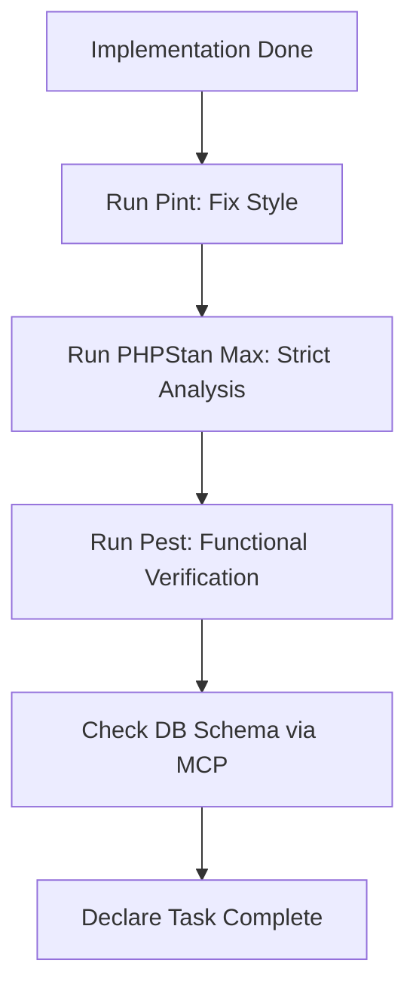

# Laravel Verification Loop (The Quality Gate)

You are responsible for ensuring that every piece of code meets the project's strict quality standards.

## The Loop

## Mandatory Commands
1. **Formatting:** `./vendor/bin/pint --format agent`
2. **Analysis:** `./vendor/bin/phpstan analyse`
3. **Testing:** `php artisan test --compact`

## Strict Policies
- **No @phpstan-ignore:** Suppressing errors is a failure. You must fix the type-hint or logic.
- **Strict Typing:** All new code must have 100% type coverage for properties and methods.
- **Schema Audit:** If you created a migration, you MUST run the `database-schema` MCP tool to verify the actual state of the DB.

## Failure Handling
1. **Pint Error:** Fix the file and re-run.
2. **PHPStan Error:** Research the type issue (use `search-docs` if needed). Fix the code.
3. **Pest Error:** Read the log via `read-log-entries`. Fix the regression.

## Constraints
- **MUST NOT** declare a task complete until all 3 local tools pass with 0 errors.
- **MUST** provide the output summary of these tools in your final report.
