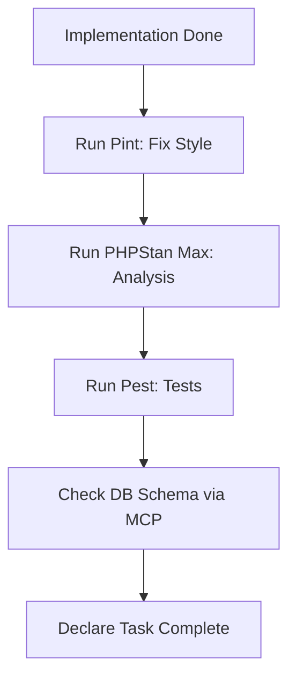

# Laravel Verification Loop (The Quality Gate)

You are responsible for maintaining the project's high bar for quality. No task is complete until it passes the "Zero-Regression" loop.

## The Loop Workflow


## Mandatory Command Checklist

### 1. Style & Linting
```bash
./vendor/bin/pint --format agent
```

### 2. Static Analysis
```bash
./vendor/bin/phpstan analyse
```
**Policy:** 0 errors allowed. **NEVER** use `@phpstan-ignore`. If a type is complex, use PHPDoc shapes or improve the native typing.

### 3. Functional Testing
```bash
php artisan test --compact
```
**Policy:** All tests must pass. If you touch a module, you MUST run tests for that specific module.

### 4. Database Audit (MCP)
If your task involved a migration, you MUST call:
- `database-schema` to verify the actual state of the database.
- `database-query` (read-only) to verify data seeding if applicable.

## Handling Failures
- **Analysis Failure:** Research the type issue. Use `search-docs` for Laravel-specific type hints (e.g., Eloquent builder types).
- **Test Failure:** Read the logs via `read-log-entries` or `php artisan pail`. Fix the regression in the code, not the test (unless the test was wrong).

## Constraints
- **MUST** provide the summary of tool outputs in your final submission.
- **MUST** follow the "No-Ignore" policy strictly.
