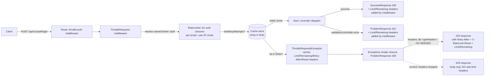

# Phase 1: Quality Foundation - Research

**Researched:** 2026-08-03
**Domain:** Laravel API contract verification (rate limiting, response envelope, PHPStan/Pest quality gates)
**Confidence:** HIGH (core mechanics verified empirically this session via real-route probes)

## Summary

This phase is verification + gap closure on an already-green baseline. The critical discovery: **the shipped 429 response currently drops ALL rate-limit headers** (X-RateLimit-Limit, X-RateLimit-Remaining, Retry-After, X-RateLimit-Reset). The throttle middleware puts them on the `ThrottleRequestsException`, but the custom ProblemResponse render path in `bootstrap/app.php` never forwards the exception headers to the response. D-03's 429 header assertions will FAIL against the current implementation, so the phase needs one production-code fix (`headers: $e->getHeaders()` in the 429 render closure) plus a test asserting it. This was confirmed empirically with a real-route probe (3rd login request returned 429 with a correct ProblemResponse body but zero rate-limit headers).

Everything else in the plan works as the user decided: `config()->set()` does affect the named `auth` rate limiter (verified: Limit header reflected the overridden value), 3rd request 429s under `limit=2` (N+1 semantics confirmed), 200/422 responses carry X-RateLimit-Limit/Remaining with the tightest limiter's values, and module test files are discovered via the existing "Modules" phpunit testsuite + `tests/Pest.php` binding. PHPStan at max level analyzes module Pest files cleanly (verified by temporarily removing the exclude and running `phpstan analyse` with a representative module test file - 0 errors). Type coverage (100% gate) DOES include module test files (the type-coverage plugin ignores phpunit.xml source excludes and scans all of `app/` + `modules/`), so the new test file must carry `declare(strict_types=1)` and fully typed code - verified 100% still holds with a properly typed module test file present.

**Primary recommendation:** Plan one production change (429 render closure forwards `$e->getHeaders()`) + one new module feature test file (`modules/IAM/Tests/Feature/AuthRateLimitTest.php`) + the phpstan.neon exclude removal. Do NOT plan any new packages, middleware, or enforcement mechanisms (D-08).

<user_constraints>
## User Constraints (from CONTEXT.md)

### Locked Decisions

#### Rate-Limit Verification Scope
- **D-01:** Cover all `throttle:auth` routes — login, register, forgot-password, reset-password — in the new contract tests. Per-limiter class scope (api/authenticated) is out of scope; those routes belong to later phases. — **Reversibility:** reversible — adding routes to the test file later is cheap
- **D-02:** On 200 responses assert `X-RateLimit-Limit` and `X-RateLimit-Remaining` with the actual config values (`rate-limiting.auth.limit_per_email` / `limit_per_ip`). `X-RateLimit-Reset` is NOT asserted on 200 — the framework only sends it (plus `Retry-After`) on 429 responses (verified in `vendor/laravel/framework/src/Illuminate/Routing/Middleware/ThrottleRequests.php` `getHeaders()`). — **Reversibility:** reversible
- **D-03:** On 429 assert full `ProblemResponse` body (status, title, detail) plus `Retry-After` and `X-RateLimit-Reset` headers. Two separate scenarios: per-email limit exceeded and per-IP limit exceeded. — **Reversibility:** reversible
- **D-04:** Simulate limit exhaustion via `config()->set()` overriding `rate-limiting.auth.limit_per_*` to small values (e.g., 2), then send N+1 requests. Do NOT send the real 5/10 requests — slow and env-dependent. — **Reversibility:** reversible

#### Contract Test Location & Shape
- **D-05:** Keep the existing structure — no new `tests/Feature/Contract/` suite. Unit tests for response shape stay in `tests/Unit/Http/Responses/` and are left unchanged.
- **D-06:** New feature tests live in `modules/IAM/Tests/Feature/AuthRateLimitTest.php` — a single file with `describe()` per route (login, register, forgot-password, reset-password) and per-email/per-IP scenarios as separate `describe()` blocks. Infrastructure already exists: `tests/Pest.php` binds `TestCase` + `RefreshDatabase` for `../modules/*/Tests/Feature`, phpunit.xml has the "Modules" testsuite, helpers (`assertProblemResponse`, etc.) are auto-loaded by Pest.
- **D-07:** In addition to rate-limit tests, add ONE success-flow test asserting `SuccessResponse` shape via a real route (login success → `{status, data}` + rate-limit headers). This closes the API-02 end-to-end verification gap. Validation-error (422) cases are NOT added here — already covered elsewhere. — **Reversibility:** reversible

#### Failing-Fast Enforcement
- **D-08:** No new enforcement mechanisms (no pre-commit hook, no `quality:check` command, no arch rules). `composer test:quality` (manual) + CI `tests.yml` running `composer ci:check` are sufficient. — **Reversibility:** reversible
- **D-09:** Phase is complete when: all gates green (PHPStan 0 errors at max, type coverage 100%, suite passes) AND the new rate-limit feature tests pass. — **Reversibility:** reversible
- **D-10:** Any unexpected findings surfaced by the new verification tests are fixed IN THIS PHASE — the contract is the source of truth. No deferring.

#### PHPStan Scope
- **D-11:** Remove `modules/*/Tests/*` from `excludePaths` in `phpstan.neon` so module test files are analyzed at max level. This strengthens the gate (consistent with AGENTS.md's prohibition on weakening config — the ban targets lowering level/adding ignores, not removing excludes). `modules/IAM/Tests/` is currently empty, so no immediate errors; the effect lands as module tests are written (this phase and Phase 2 Authentication).
- **D-12:** The `tests` path in `phpstan.neon` (root `tests/` directory) stays as-is — only the module exclude is removed.

#### Phase Positioning
- **D-13:** This phase is verification + gap closure, not new feature building. Baseline (QLTY-01/02) already green: `composer types:check` exits 0 at max level, `composer test:quality` reports 100% type coverage, full suite 269 tests passing. All findings are resolved in this phase; nothing is deferred.

### the agent's Discretion
- Test naming conventions, `describe()` grouping granularity, and exact assertion helpers usage are left to the planner/executor following project Pest conventions (`it()` + `describe()`, `toBeSuccessResponse()`/`toBeProblemResponse()` helpers, `config()->string()` config access).

### Deferred Ideas (OUT OF SCOPE)
- Rate-limit verification for `throttle:api` (email-verification, social routes, users/roles) and `throttle:authenticated` limiter classes — belongs to Phase 2/3 (Authentication, Social Auth) where those routes are built/verified.
- Full 429 retry-flow test (travel 60s + assert recovery) — considered, not chosen; adds runtime without proportional value.
- PHPStan analysis for module tests may surface type errors in factory files as tests get written — not deferred, will be resolved in-phase as they arise.
</user_constraints>

<phase_requirements>
## Phase Requirements

| ID | Description | Research Support |
|----|-------------|------------------|
| QLTY-01 | PHPStan runs at max level on production code with zero errors | Baseline green today. D-11 validated empirically: with `modules/*/Tests/*` removed from `excludePaths`, `phpstan analyse` (max level, larastan + pest-plugin-phpstan) passes on a representative module Pest test file with 0 errors. No phpstan.neon level/config changes needed. |
| QLTY-02 | 100% type coverage achieved | `composer test:quality` runs `pest --coverage --type-coverage --min=100`. Type coverage includes module test files (plugin ignores phpunit.xml source excludes; scans all of `app/` + `modules/`). Verified: a properly typed module test file (strict_types, typed closures/methods) keeps 100%. Code coverage (`--coverage`) excludes `modules/*/Tests` and cannot regress from adding tests. |
| API-01 | All routes versioned under `/api/v1` | Routes in `modules/IAM/Routes/V1.php` under `Route::prefix('auth')` mounted at `/api/v1` (routes/api.php). New tests hit `/api/v1/auth/*` - versioning exercised implicitly. |
| API-02 | Responses use SuccessResponse/ProblemResponse RFC 9457 contract | Verified empirically: real login success returns `{status:200, title:'OK', detail, data:{user, access_token, token_type, expires_at, expires_in}}`; real 429 returns `{type: .../problems/rate-limit-exceeded, title:'Too Many Requests', status:429, detail:'Too Many Attempts.', timestamp}` with `Content-Type: application/problem+json`. D-07 success-flow test feasible. |
| API-03 | Auth routes enforce rate limiting with rate limit headers | Verified empirically: per-email and per-IP limits both fire (3rd request 429s under limit=2); 200/422 responses carry `X-RateLimit-Limit`/`X-RateLimit-Remaining` reflecting the tighter limit. **GAP FOUND:** the 429 response currently drops ALL rate-limit headers (Limit/Remaining/Retry-After/Reset) - the ProblemResponse render path does not forward `$e->getHeaders()`. Fix required in this phase (D-10). |
</phase_requirements>

## Architectural Responsibility Map

| Capability | Primary Tier | Secondary Tier | Rationale |
|------------|-------------|----------------|-----------|
| Rate limiting enforcement | API / Backend (middleware) | Cache (array store in tests) | `ThrottleRequests` middleware + `RateLimiter::for('auth')` closures in `AppServiceProvider`; counters live in the cache store (array in tests) |
| Rate-limit header contract | API / Backend (middleware + exception render) | — | Headers are added by `ThrottleRequests::addHeaders` (200/422) and by the exception object on 429; the 429 render closure must forward them |
| Response envelope (Success/Problem) | API / Backend (Responsable classes) | — | `SuccessResponse`/`ProblemResponse` produce the JSON shape; exception render closures in `bootstrap/app.php` own the error path |
| Quality gates (PHPStan, type coverage) | Dev tooling (CLI, not runtime) | — | `composer types:check` / `test:quality` scripts; module test files are now in scope for analysis and type coverage |
| Test infrastructure | Dev tooling (Pest/PHPUnit) | — | `tests/Pest.php` binds TestCase+RefreshDatabase; phpunit.xml "Modules" testsuite discovers `modules/*/Tests` |

## Standard Stack

This phase introduces NO new packages. It operates entirely on the existing, already-installed toolchain:

### Core
| Tool | Version | Purpose | Why Standard |
|------|---------|---------|--------------|
| PHP | 8.4.22 (cli, ZTS VC++ x64) | Runtime | `[VERIFIED: php --version 2026-08-03]`; matches `composer.json` platform `"php": "8.4.22"` (composer.json:190-191) |
| laravel/framework | ^13.6.0 | Framework | `[VERIFIED: composer.json:14]` |
| pestphp/pest | 5.0.2 (pin) | Test runner | `[VERIFIED: composer.json:32]` |
| pestphp/pest-plugin-laravel | 5.0.1 | Laravel test bindings | `[VERIFIED: composer.json:34]` |
| larastan/larastan | ^3.9 | PHPStan Laravel rules | `[VERIFIED: composer.json:25]`; phpstan level max (phpstan.neon:17) |
| pestphp/pest-plugin-phpstan | ^5.0 | Pest-aware PHPStan analysis (Pest globals, `pest.config.*` rules) | `[VERIFIED: composer.json:35]` + `[VERIFIED: vendor/pestphp/pest-plugin-phpstan/extension.neon]` |
| pestphp/pest-plugin-type-coverage | 5.0 | `--type-coverage --min=100` gate | `[VERIFIED: composer.json:38]`; config in `vendor/pestphp/pest-plugin-type-coverage/resources/phpstan.neon` (return/param/property type 100) |
| phpstan/extension-installer | ^1.4 | Auto-loads vendor extension.neon files (larastan, pest, type rules) | `[VERIFIED: composer.json:39]` |

### Supporting
| Tool | Version | Purpose | When to Use |
|------|---------|---------|--------------|
| laravel/pint | ^1.27 | Style gate (`lint:check`) | Runs inside `test:quality` before tests |
| pestphp/pest-plugin-profanity | 5.0 | Profanity gate | Runs inside `ci:check` after quality |
| rector/rector | ^2.5 | Refactor dry-run | Runs inside `ci:check` |
| phpunit/phpunit | 13.x (via pest) | Coverage engine for `--coverage --min=100` | Uses phpunit.xml `<source>` |

### Alternatives Considered
| Instead of | Could Use | Tradeoff |
|------------|-----------|----------|
| Real 5/10 requests in tests | `config()->set()` to simulate limit=2 (D-04) | Config override is deterministic and fast; empirically proven to affect the named limiter |
| New `tests/Feature/Contract/` suite | Reuse `modules/IAM/Tests/Feature/` (D-05/D-06) | Existing discovery + Pest bindings already work; no phpunit.xml change |
| Assert exact Retry-After/X-RateLimit-Reset values | Presence + sanity assertions only | Values are wall-clock dependent (`availableIn()` seconds, `availableAt()` timestamp); assert presence/numeric, not exact values |

**Installation:** none. `composer install` state already contains everything; no `composer require` in this phase.

**Version verification:** All versions above verified against `composer.json` this session (`[VERIFIED]`).

## Package Legitimacy Audit

> This phase installs NO external packages. The entire phase operates on the already-installed toolchain (pest, phpstan, larastan, pint — all pinned in composer.json and already running green in the baseline). The Package Legitimacy Gate protocol is therefore **N/A** — there is nothing new to audit and nothing for the planner to gate behind a checkpoint.

| Package | Registry | Age | Downloads | Source Repo | Verdict | Disposition |
|---------|----------|-----|-----------|-------------|---------|-------------|
| *(no new packages - audit N/A)* | — | — | — | — | — | — |

**Packages removed due to [SLOP] verdict:** none
**Packages flagged as suspicious [SUS]:** none

## Architecture Patterns

### System Architecture Diagram



Trace the primary use case: client hits login -> throttle middleware resolves the `auth` limiter (two Limits: per-email keyed by `request->input('email')`, per-IP keyed by `request->ip()`) -> counters checked/hit in the cache store -> under limit, controller runs and the middleware stamps X-RateLimit-Limit/Remaining on the response (200 or 422) -> over limit, `ThrottleRequestsException` is thrown carrying all four headers, and `bootstrap/app.php`'s 429 render closure converts it to a ProblemResponse - which today drops the headers and must be fixed to forward `$e->getHeaders()`.

### Recommended Project Structure

```
modules/IAM/Tests/Feature/     # NEW: AuthRateLimitTest.php (the only new source file)
├── AuthRateLimitTest.php      # describe() per route x per-email/per-IP scenarios
bootstrap/app.php              # EDIT: 429 render closure gains headers: $e->getHeaders()
phpstan.neon                   # EDIT: remove '- modules/*/Tests/*' from excludePaths (D-11)
tests/                         # UNCHANGED (D-05, D-12)
```

### Pattern 1: Rate-Limit Scenario Test (per-email)
**What:** Simulate exhaustion with `config()->set()`, send N+1 requests, assert 429 ProblemResponse + headers after the fix.
**When to use:** All `throttle:auth` routes; per-email and per-IP variants.
**Example (validated against this codebase this session):**
```php
config()->set('rate-limiting.auth.limit_per_email', 2);
config()->set('rate-limiting.auth.limit_per_ip', 100);

// Request 1: 422 (failed login) with X-RateLimit-Limit: '2', X-RateLimit-Remaining: '1'
// Request 2: 422 with X-RateLimit-Limit: '2', X-RateLimit-Remaining: '0'
// Request 3: 429 ProblemResponse {type: .../problems/rate-limit-exceeded, title: 'Too Many Requests',
//            status: 429, detail: 'Too Many Attempts.', timestamp} - Content-Type: application/problem+json
//            headers AFTER FIX: X-RateLimit-Limit: '2', X-RateLimit-Remaining: '0',
//            Retry-After: <seconds int>, X-RateLimit-Reset: <unix timestamp>
```
Verified empirically via real-route probe, 2026-08-03 (3 requests against `/api/v1/auth/login`).

### Pattern 2: The 429 Header Fix
**What:** Forward the exception's headers into the ProblemResponse so the 429 carries the rate-limit contract headers.
**When to use:** This phase, as the only production change (D-10).
**Example (exact edit in `bootstrap/app.php`, 429 render closure, currently lines 131-138):**
```php
$exceptions->render(function (TooManyRequestsHttpException $e, Request $request): ProblemResponse {
    return new ProblemResponse(
        typeKey: 'rate_limited',
        title: __('auth.http_too_many_requests'),
        status: $e->getCode() !== 0 ? $e->getCode() : Response::HTTP_TOO_MANY_REQUESTS,
        detail: $e->getMessage() !== '' ? $e->getMessage() : __('auth.rate_limited_detail'),
        headers: $e->getHeaders(),  // <-- ADD THIS LINE
    );
});
```
`ProblemResponse` accepts `array $headers = []` (7th constructor param, problem-response contract: `app/Http/Responses/ProblemResponse.php:29-37`) and merges them in `toResponse()` (`:71-73`). `HttpException::getHeaders()` returns the stored array verbatim (`[VERIFIED: vendor/symfony/http-kernel/Exception/HttpException.php:57-60]`). The exception carries X-RateLimit-Limit/Remaining/Retry-After/X-RateLimit-Reset because `ThrottleRequests::buildException` passes `$this->getHeaders($maxAttempts, 0, $retryAfter)` into the exception (`[VERIFIED: vendor/.../ThrottleRequests.php:244-257]`).

### Anti-Patterns to Avoid
- **Adding `uses(RefreshDatabase::class)` in module Feature tests:** Pest.php already applies it globally for `Feature` and `../modules/*/Tests/Feature`. PHPStan's pest rule flags it: `pest.config.redundantLocalUse` - "RefreshDatabase is already applied globally through tests/Pest.php for this test file" (observed live this session). Do not repeat the binding.
- **Asserting exact Retry-After / X-RateLimit-Reset values:** wall-clock dependent (`availableIn()` = remaining seconds, `availableAt()` = unix ts). Assert header presence and numeric/future shape instead.
- **Asserting the translated `auth.rate_limited_detail` on a real 429:** the middleware hardcodes the exception message `'Too Many Attempts.'`, which the render closure prefers over the translation (`detail: $e->getMessage() !== '' ? ...`). Real-route 429 detail is `'Too Many Attempts.'` (verified empirically). The translation fallback only appears when the message is empty (as in the existing unit test that constructs `new TooManyRequestsHttpException(60)`).
- **`dump()`/`var_dump()` in tests:** phpunit.xml sets `beStrictAboutOutputDuringTests="true"` and `failOnRisky="true"` - any output fails the run.
- **Untyped closure params in the module test file:** type coverage counts every `FunctionLike` param except zero-param closures. `collect(...)->each(function ($item) {})` or similar would drop the file below 100%.

## Don't Hand-Roll

| Problem | Don't Build | Use Instead | Why |
|---------|-------------|-------------|-----|
| Asserting response envelope shape | Custom JSON assertions | `assertSuccessResponse()` / `assertProblemResponse()` helpers (`tests/Helpers.php:119-164`) | Typed, Pest-friendly, already used across the suite; they are plain typed functions so PHPStan at max level resolves them |
| Rate-limit simulation | Real 5/10 request loops or sleeping | `config()->set('rate-limiting.auth.limit_per_*', 2)` + N+1 requests | Empirically proven to work: the limiter closures read `config()->integer(...)` lazily at request time (AppServiceProvider.php:141-149), not at boot |
| 429 header forwarding | Re-implementing header computation in the render closure | `headers: $e->getHeaders()` | The middleware already computed correct values; the exception stores them; only the render path drops them |
| Test discovery plumbing | New testsuite/autoload entries | Existing "Modules" testsuite + `tests/Pest.php` binding | phpunit.xml:27-29 + tests/Pest.php:20-23 already discover `modules/*/Tests/Feature` with RefreshDatabase; `Modules\` is in the main PSR-4 autoload (composer.json:46-47) |

**Key insight:** The framework already does the hard work (limiter resolution, key hashing, header computation). The tests only need to (a) drive real requests through real routes and (b) assert the contract - plus one 1-line fix so the 429 actually delivers the headers the middleware already computed.

## Runtime State Inventory

> This phase is NOT a rename/refactor/migration phase - it is verification + one-line exception-render fix + a phpstan.neon exclude removal. Runtime state inventory is therefore N/A (no stored data, live service config, OS registrations, secrets, or build artifacts are touched; nothing persists beyond the repo).

## Common Pitfalls

### Pitfall 1: 429 drops all rate-limit headers (THE critical finding)
**What goes wrong:** D-03 asserts Retry-After + X-RateLimit-Reset on 429 - they are absent today. Empirically, the 429 body was correct but `X-RateLimit-Limit`, `X-RateLimit-Remaining`, `Retry-After`, `X-RateLimit-Reset` were ALL missing.
**Why it happens:** `ThrottleRequests::buildException` attaches the headers to the `ThrottleRequestsException`, but `bootstrap/app.php`'s custom 429 render closure constructs `ProblemResponse` without `$e->getHeaders()`, and no later stage merges exception headers back (verified in `Illuminate\Foundation\Exceptions\Handler::render()` flow: render callback result goes through the `respond()` callback, which only re-applies Trace/Security headers).
**How to avoid:** Add `headers: $e->getHeaders()` to the 429 render closure (Pattern 2). Then assert the headers in the feature test AND extend the existing `ExceptionHandlerTest` 429 case (it constructs `new TooManyRequestsHttpException(60)` so `Retry-After` becomes `'60'` after the fix).
**Warning signs:** `$response->assertHeader('Retry-After')` fails on a real-route 429 while the unit test (`ExceptionHandlerTest`) passes - the unit test never asserted headers.

### Pitfall 2: Asserting the wrong detail message on 429
**What goes wrong:** `expect($response->json('detail'))->toBe(__('auth.rate_limited_detail'))` fails on real routes.
**Why it happens:** Real `ThrottleRequestsException` messages are `'Too Many Attempts.'` (hardcoded in `ThrottleRequests.php:256`), which the render closure prefers. The translated fallback only fires for empty messages (the unit-test path).
**How to avoid:** Assert `'Too Many Attempts.'` in the real-route test; keep `__('auth.rate_limited_detail')` in the existing unit test (it constructs an empty-message exception).
**Warning signs:** 429 body assertion fails only in feature tests, passes in unit test.

### Pitfall 3: `config()->set()` placed too late or asserting the wrong limiter's value
**What goes wrong:** Asserting `X-RateLimit-Limit` equals `limit_per_email` when the per-IP limit is tighter (or vice versa).
**Why it happens:** With multiple Limits, the middleware iterates and only overwrites headers when the new remaining count is strictly smaller (`ThrottleRequests::getHeaders` guard, lines 302-306). The final header shows the TIGHTEST limit: default config (5/10) shows `Limit: 5, Remaining: 4` after one request (verified empirically). In the per-email scenario (2/100) it shows `2`, in the per-IP scenario (100/2) it shows `2`.
**How to avoid:** Assert against the value of whichever limiter is tighter under the scenario's config (compute or assert the config value that matches the scenario: per-email scenario -> `limit_per_email`, per-IP scenario -> `limit_per_ip`).
**Warning signs:** Header value differs from the asserted config key.

### Pitfall 4: PHPStan `pest.config.redundantLocalUse` on module tests
**What goes wrong:** Adding `uses(RefreshDatabase::class)` in `modules/IAM/Tests/Feature/AuthRateLimitTest.php` fails `types:check`.
**Why it happens:** `tests/Pest.php:20-23` already binds `RefreshDatabase` for `../modules/*/Tests/Feature`; the pest-plugin-phpstan `RedundantLocalUseRule` flags the duplicate (observed live this session).
**How to avoid:** Omit the `uses()` call entirely; the binding is automatic.
**Warning signs:** New phpstan error identifier `pest.config.redundantLocalUse` on the new file.

### Pitfall 5: Type coverage regression from the new module test file
**What goes wrong:** `composer test:quality` fails at `--type-coverage --min=100` after adding the file.
**Why it happens:** The type-coverage plugin scans `source()->includeDirectories()` (app + modules) and does NOT apply phpunit.xml `<exclude>` filters (`[VERIFIED: vendor/pestphp/pest-plugin-type-coverage/src/Support/ConfigurationSourceDetector.php:24-37]`). Module test files therefore count toward the 100% gate. Pest `it()/describe()` closures are exempt (zero params are skipped; return types only count on class methods - `[VERIFIED: .../Collectors/ParamTypeDeclarationCollector.php:68-76]` and `ReturnTypeDeclarationCollector.php:17-20]`), but any untyped closure param, method return, or property drops the file below 100%.
**How to avoid:** `declare(strict_types=1)`; fully typed helper methods/properties; no untyped closure params. Verified: a compliant module test file keeps 100.0% (measured this session).
**Warning signs:** Type coverage report lists the new file with uncovered type markers.

### Pitfall 6: Request payloads missing required fields
**What goes wrong:** Rate-limit scenarios for register/reset-password 422 immediately for missing `password_confirmation`.
**Why it happens:** `passwordRules()` includes `confirmed` (verified: register probe returned 422 "The password field confirmation does not match").
**How to avoid:** Request bodies: login `{email, password}`; register `{name, email, password, password_confirmation}`; forgot-password `{email}`; reset-password `{token, email, password, password_confirmation}` (from `modules/IAM/Requests/V1/*Request.php`).
**Warning signs:** 422 validation errors instead of the expected 200/429.

## Code Examples

Verified patterns from official sources and this session's probes:

### Rate-limit feature test skeleton (module test - the deliverable)
```php
<?php

declare(strict_types=1);

use Modules\IAM\Database\Factories\UserFactory;

describe('login rate limit', function () {
    describe('per-email', function () {
        it('returns 429 with problem response when per-email limit is exceeded', function () {
            config()->set('rate-limiting.auth.limit_per_email', 2);
            config()->set('rate-limiting.auth.limit_per_ip', 100);

            // Request 1 + 2 pass (422 failed-login responses, Limit/Remaining headers present)
            $this->postJson('/api/v1/auth/login', ['email' => 'limit@example.com', 'password' => 'wrong'])
                ->assertStatus(422)
                ->assertHeader('X-RateLimit-Limit', '2');

            // Request 3: 429
            $response = $this->postJson('/api/v1/auth/login', ['email' => 'limit@example.com', 'password' => 'wrong']);

            assertProblemResponse($response, 429, 'rate-limit-exceeded');
            expect($response->json('detail'))->toBe('Too Many Attempts.')   // framework literal, verified
                ->and($response->headers->get('X-RateLimit-Limit'))->toBe('2')
                ->and($response->headers->get('X-RateLimit-Remaining'))->toBe('0')
                ->and($response->headers->get('Retry-After'))->toBeGreaterThanOrEqual(1)
                ->and((int) $response->headers->get('X-RateLimit-Reset'))->toBeGreaterThan(time());
        });
    });

    describe('per-ip', function () {
        it('returns 429 when per-ip limit is exceeded across distinct emails', function () {
            config()->set('rate-limiting.auth.limit_per_email', 100);
            config()->set('rate-limiting.auth.limit_per_ip', 2);

            $this->postJson('/api/v1/auth/login', ['email' => 'ip1@example.com', 'password' => 'wrong'])->assertStatus(422);
            $this->postJson('/api/v1/auth/login', ['email' => 'ip2@example.com', 'password' => 'wrong'])->assertStatus(422);

            $response = $this->postJson('/api/v1/auth/login', ['email' => 'ip3@example.com', 'password' => 'wrong']);

            assertProblemResponse($response, 429, 'rate-limit-exceeded');
        });
    });
});

describe('login success flow', function () {
    it('returns success response shape with rate limit headers', function () {
        $user = UserFactory::new()->createOne([
            'email' => 'success@example.com',
            'password' => 'secret-password',
        ]);

        $response = $this->postJson('/api/v1/auth/login', ['email' => $user->email, 'password' => 'secret-password']);

        assertSuccessResponse($response, 200, 'OK');  // asserts {status, title, detail, data}
        expect($response->json('data'))->toHaveKeys(['user', 'access_token', 'token_type', 'expires_at', 'expires_in'])
            ->and($response->headers->get('X-RateLimit-Limit'))->toBe((string) config()->integer('rate-limiting.auth.limit_per_email'))
            ->and($response->headers->get('X-RateLimit-Remaining'))->toBe('4');  // 5 - 1, default config
    });
});
```
Behavior behind this skeleton was verified empirically this session (probe against the real routes; per-email scenario: 422/422/429 with Limit '2' on 200s; per-IP scenario: 422/422/429; success: 200 with `{status:200, title:'OK', detail:'Login successful.', data:{...}}` and `Limit: '5', Remaining: '4'`).

### The production fix (bootstrap/app.php 429 render closure)
```php
// bootstrap/app.php:131-138 (current) -> add the headers line
$exceptions->render(function (TooManyRequestsHttpException $e, Request $request): ProblemResponse {
    return new ProblemResponse(
        typeKey: 'rate_limited',
        title: __('auth.http_too_many_requests'),
        status: $e->getCode() !== 0 ? $e->getCode() : Response::HTTP_TOO_MANY_REQUESTS,
        detail: $e->getMessage() !== '' ? $e->getMessage() : __('auth.rate_limited_detail'),
        headers: $e->getHeaders(),
    );
});
```

### phpstan.neon change (D-11)
```diff
     excludePaths:
-        - modules/*/Tests/*
```
Verified: with the exclude removed, `php vendor/bin/phpstan analyse --memory-limit=512M` exits 0 while a representative module Pest test file is in `modules/IAM/Tests/Feature/`.

## State of the Art

| Old Approach | Current Approach | When Changed | Impact |
|--------------|------------------|--------------|--------|
| Exception headers implicit in Symfony default renderer | Custom `render()` callbacks must forward `$e->getHeaders()` manually | Since Laravel 11's `bootstrap/app.php` exception configuration | Easy to silently drop headers (exactly what happened here); any custom render closure for HTTP exceptions should forward headers |
| Tests asserting only status codes | Contract-shaped assertions via `assertSuccessResponse`/`assertProblemResponse` + header assertions | Project convention (already in use) | Tests pin the API contract, not implementation |
| PHPStan analyzing only root `tests/` | Module tests analyzed at max level (D-11) | This phase | New module test files must satisfy larastan + pest-plugin-phpstan rules (redundant-use rule already active) |

**Deprecated/outdated:**
- `ThrottleRequests::shouldHashKeys` toggling: unnecessary - default key hashing (`md5($limiterName.$key)`) is correct for multi-limiter setups; don't disable it in tests.

## Assumptions Log

| # | Claim | Section | Risk if Wrong |
|---|-------|---------|---------------|
| A1 | Each Pest test gets a fresh application instance, so the array cache store (rate-limit counters) does not leak between tests | Common Pitfalls / test design | LOW - empirically supported: every probe test's first request showed fresh counters (`Remaining: 4` on first request in each test); cross-test leakage would have shown accumulating values |
| A2 | `composer test:quality`'s pest `--ci` flag has no behavior relevant to this phase's assertions | Validation Architecture | LOW - `--ci` affects output/interaction modes only; the gates that matter (`--coverage`, `--type-coverage`, `--min=100`) are explicit flags |
| A3 | The generic `HttpExceptionInterface` render closure (bootstrap/app.php:151-158) also drops exception headers, but no phase requirement asserts headers on those paths | Architecture Patterns | LOW - out of scope for D-01..D-07; a consistency follow-up could forward headers there too, but nothing in this phase depends on it |
| A4 | Module test files need no namespace declaration to be discovered | Code Examples | LOW - `tests/Pest.php` binding and phpunit.xml "Modules" testsuite are path-based; root `tests/Feature` files are namespace-less. If a namespace is used, it should be `Modules\IAM\Tests\Feature` (matches PSR-4 `Modules\` -> modules/) |

## Open Questions

1. **Should the fix also extend the generic `HttpExceptionInterface` render closure (bootstrap/app.php:151-158)?**
   - What we know: it also constructs ProblemResponse without headers; a 429 never reaches it (429 has its own closure first), so this phase's assertions don't need it.
   - What's unclear: whether the user wants uniform header forwarding for all HTTP exceptions (403 Retry-After, 503 Retry-After, etc.).
   - Recommendation: fix only the 429 closure (D-03 scope). Leave the generic closure untouched; note it in the plan as an intentional non-change.

2. **Assertion style for `X-RateLimit-Reset`/`Retry-After` values on 429**
   - What we know: values are wall-clock derived (`availableIn()` seconds, `availableAt()` unix ts); exact equality is flaky (59 vs 60 depending on elapsed ms).
   - What's unclear: preferred strictness (presence-only vs. range vs. `>= now`).
   - Recommendation: presence + numeric sanity (Retry-After >= 1, Reset > now). The planner may assert exact values if determinism is preferred - not recommended.

3. **Should the existing `ExceptionHandlerTest` 429 case gain header assertions?**
   - What we know: after the fix, `new TooManyRequestsHttpException(60)` renders with `Retry-After: '60'` (Symfony sets it when retryAfter is truthy).
   - What's unclear: whether the phase's unit-test scope may touch this file (D-05 says response-shape unit tests stay unchanged; ExceptionHandlerTest is a rendering test, not a shape test).
   - Recommendation: yes - one `assertHeader('Retry-After', '60')` line closes the unit-level regression risk and is consistent with D-10. Confirm with user if strict reading of D-05 is preferred.

## Environment Availability

| Dependency | Required By | Available | Version | Fallback |
|------------|------------|-----------|---------|----------|
| PHP CLI | All gates (phpstan, pest) | ✓ | 8.4.22 | — |
| Composer vendor/ | All gates | ✓ | installed (pest 5.0.2, larastan ^3.9) | `composer install` |
| SQLite (in-memory) | Feature tests (phpunit.xml `:memory:`) | ✓ | bundled with PHP | — |
| MySQL | NOT required - tests run on sqlite | ✓ (FlyEnv) | — | — |
| Node/npm | NOT required this phase | — | — | — |

**Missing dependencies with no fallback:** none.
**Missing dependencies with fallback:** none.

## Validation Architecture

> `workflow.nyquist_validation` is absent from `.planning/config.json` (no config file exists) - treated as enabled.

### Test Framework
| Property | Value |
|----------|-------|
| Framework | Pest 5.0.2 (PHPUnit 13 engine) |
| Config file | phpunit.xml (testsuites: Architecture, Unit, Feature, Modules; sqlite :memory:, CACHE_STORE=array, beStrictAboutOutputDuringTests, failOnRisky) |
| Quick run command | `php vendor/bin/pest modules/IAM/Tests/Feature/AuthRateLimitTest.php --compact --no-tia` |
| Full suite command | `composer test` (lint + types + pest --parallel) |

### Phase Requirements → Test Map
| Req ID | Behavior | Test Type | Automated Command | File Exists? |
|--------|----------|-----------|-------------------|-------------|
| QLTY-01 | PHPStan max, 0 errors (incl. module tests after D-11) | static analysis | `composer types:check` | ✅ phpstan.neon |
| QLTY-02 | 100% type coverage (app + modules, incl. new test file) | static analysis | `composer test:quality` | ✅ (config exists; file NEW) |
| API-02 | SuccessResponse shape via real login route | feature | `pest modules/IAM/Tests/Feature/AuthRateLimitTest.php` | ❌ NEW - AuthRateLimitTest.php |
| API-03 | 200/422 responses carry X-RateLimit-Limit/Remaining; 429 carries ProblemResponse + Retry-After/X-RateLimit-Reset | feature | same | ❌ NEW |
| API-01 | Routes under /api/v1 | implicit (all requests hit /api/v1/auth/*) | same | ✅ existing routes |

### Sampling Rate
- **Per task commit:** `php vendor/bin/pest modules/IAM/Tests/Feature/AuthRateLimitTest.php --compact --no-tia` + `composer types:check`
- **Per wave merge:** `composer test:quality` (full gate incl. coverage + type coverage)
- **Phase gate:** `composer ci:check` green (lint + types + coverage + rector + profanity) before `/gsd-verify-work`

### Wave 0 Gaps
- [ ] `modules/IAM/Tests/Feature/AuthRateLimitTest.php` - the phase deliverable itself (describe() per route, per-email/per-IP scenarios, one success-flow test)
- [ ] `bootstrap/app.php` 429 render closure fix (production change the tests verify)
- [ ] `phpstan.neon` exclude removal (D-11)
- [ ] (optional) `tests/Unit/Http/Exceptions/ExceptionHandlerTest.php` 429 case gains `Retry-After` assertion

## Security Domain

### Applicable ASVS Categories

| ASVS Category | Applies | Standard Control |
|---------------|---------|-----------------|
| V2 Authentication | yes | Rate limiting is a brute-force control on login/register/forgot/reset; per-email + per-IP keying verified working. The phase's fix makes the 429 contract (Retry-After/Reset) actually observable by clients. |
| V3 Session Management | no | Token issuance flows (Sanctum PAT) verified in later phases |
| V4 Access Control | no | No authorization changes; routes already carry Sanctum/permission middleware |
| V5 Input Validation | yes | FormRequest validation already enforced before controller logic; rate-limit tests use validation-passing payloads (422s from LoginAction, not from request rules) |
| V6 Cryptography | no | No crypto changes (Sanctum PAT, no new key handling) |

### Known Threat Patterns for {stack}

| Pattern | STRIDE | Standard Mitigation |
|---------|--------|---------------------|
| Brute-force login/credential stuffing | Tampering / DoS | Per-email (5/min) + per-IP (10/min) `auth` limiter - verified active in tests; 429 must expose Retry-After so clients back off (the fix) |
| Rate-limit bypass via rotating emails | DoS | Per-IP limit still caps the same origin (verified: 3 distinct emails, 3rd request 429s at per-IP 2) |
| Information disclosure in error detail | Information Disclosure | Real 429 detail is the generic framework literal 'Too Many Attempts.'; debug-off renders generic 500 detail (existing behavior, unchanged) |
| Cache poisoning / cross-test leakage | Tampering | Array cache store is per-application-instance; tests get fresh apps (empirically verified no leakage) |

## Sources

### Primary (HIGH confidence)
- Empirical probes against the real routes, 2026-08-03 (per-email 429, per-IP 429, success login shape/headers, register validation) - behavior confirmed end-to-end through the actual middleware + exception pipeline
- `vendor/laravel/framework/src/Illuminate/Routing/Middleware/ThrottleRequests.php` - named limiter resolution (87-91), multi-limit handling (129-141), getHeaders guard (302-306), buildException (244-257)
- `vendor/laravel/framework/src/Illuminate/Cache/RateLimiter.php` + `RateLimiting/Limit.php` - tooManyAttempts/hit/availableIn semantics, perMinute decay, by() keying
- `vendor/laravel/framework/src/Illuminate/Foundation/Exceptions/Handler.php` - render/finalizeRenderedResponse flow (custom render callbacks do not auto-merge exception headers)
- `vendor/symfony/http-kernel/Exception/HttpException.php` + `TooManyRequestsHttpException.php` + `Illuminate\Http\Exceptions\ThrottleRequestsException.php` - header storage/getHeaders
- `vendor/pestphp/pest-plugin-type-coverage/src/Support/ConfigurationSourceDetector.php` + `Plugin.php` - type coverage scans include dirs only, excludes NOT applied
- `vendor/tomasvotruba/type-coverage/src/Collectors/*` - what counts as missing types (ClassMethod returns; FunctionLike params minus zero-param closures)
- `vendor/pestphp/pest-plugin-phpstan/extension.neon` - Pest-aware PHPStan rules incl. RedundantLocalUseRule
- Live `phpstan analyse` runs with D-11 exclude removed - 0 errors with module test file present
- Live `pest --type-coverage --min=100` run with module test file present - 100.0%

### Secondary (MEDIUM confidence)
- Project files read this session: phpstan.neon, composer.json, phpunit.xml, tests/Pest.php, tests/Helpers.php, tests/Expectations.php, bootstrap/app.php, config/rate-limiting.php, AppServiceProvider.php, SuccessResponse.php, ProblemResponse.php, modules/IAM/Routes/V1.php, LoginController.php, LoginAction.php, LoginRequest/ForgotPasswordRequest/ResetPasswordRequest, ExceptionHandlerTest.php, GlobalApiMiddlewareTest.php, tests/TestCase.php

### Tertiary (LOW confidence)
- None - all claims either verified via vendor source, project files, or live execution this session

## Metadata

**Confidence breakdown:**
- Standard stack: HIGH - every tool/version verified in composer.json this session
- Architecture: HIGH - rate-limit mechanics and render path verified in vendor source + live probes
- Pitfalls: HIGH - the two contract-breaking behaviors (429 headers dropped, detail literal) verified empirically
- Type coverage behavior: HIGH - verified by code reading + live `--type-coverage` run

**Research date:** 2026-08-03
**Valid until:** 2026-08-10 (7 days - fast-moving vendor internals; the ThrottleRequests/render analysis pins Laravel 13.x behavior)
