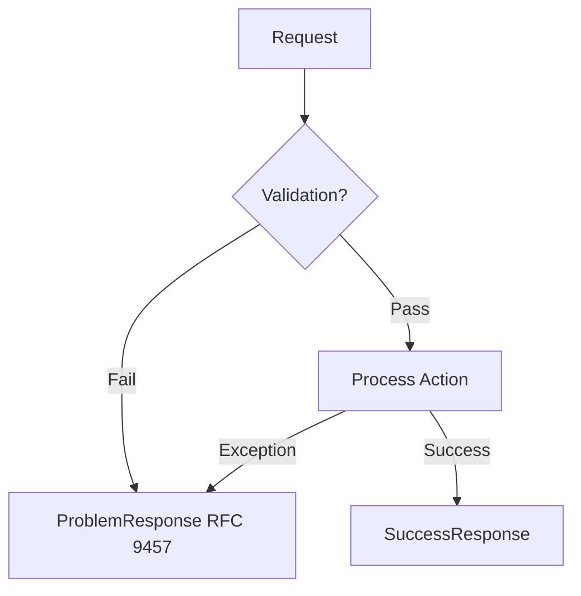
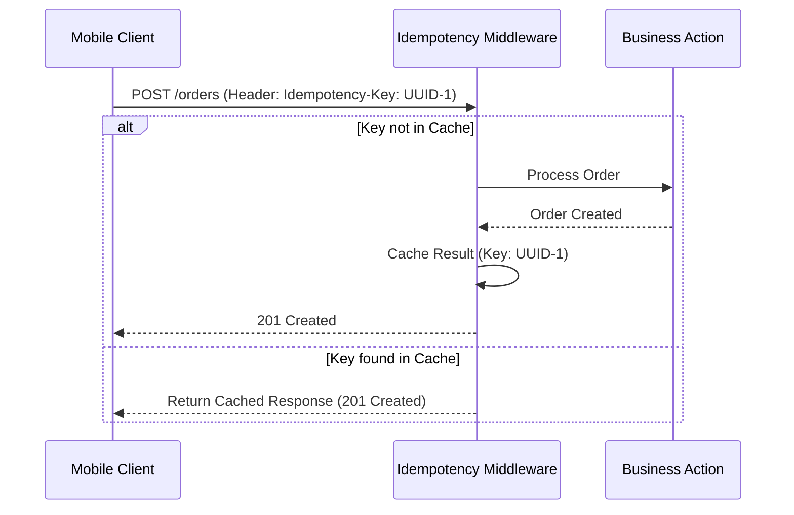

# API Standards Handbook

This API is designed for professionalism and contract stability, specifically for integration with SPA and Mobile apps.

## 1. Error Handling (RFC 9457)

We use a global standard for error responses so clients can handle errors predictably.

### Error Workflow:


**Example Error Response (422):**
```json
{
  "type": "https://api.example.com/errors/validation-failed",
  "title": "Validation Error",
  "status": 422,
  "detail": "The provided data was invalid.",
  "errors": {
    "email": ["The email has already been taken."]
  }
}
```

---

## 2. Idempotency (Idempotency-Key)

Critical for preventing duplicate data creation during unstable network connections (especially for Mobile).

### Idempotency Flow:


---

## 3. Streaming Response

Use this for large data exports without burdening the server's RAM.

**Example Case:** Exporting 100,000 transaction records to CSV.
- **Without Stream:** Server collects all data in memory -> RAM reaches limit -> Server crashes.
- **With Stream:** Server fetches 1 record -> sends it immediately to client -> fetches the next. RAM usage remains minimal.

---

## 4. Media & File Response

Always use **Signed URLs** for private/sensitive files.
- Links expire in 5-15 minutes.
- Prevents permanent exposure of private file links.

---

## 5. Rate Limiting Transparency

Every API response includes transparent headers:
- `X-RateLimit-Limit`: Maximum allowance.
- `X-RateLimit-Remaining`: Requests left.
- `X-RateLimit-Reset`: When allowance resets (Unix Timestamp).
