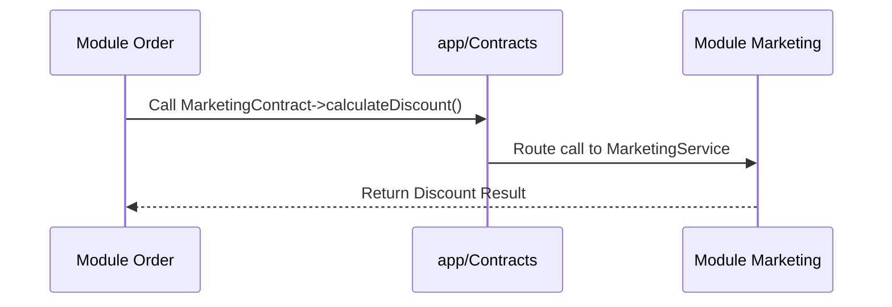
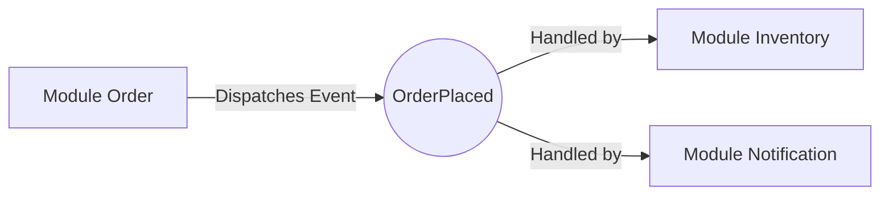

# Architecture Handbook: Modular Monolith

This starterkit is designed using a **Modular Monolith** pattern to keep the codebase clean and organized as the application grows.

## Pluggable Modules Philosophy

Modules in this project are **pluggable**. You can build new features within the `modules/` directory without breaking core functionality. If you need to remove or move a module in the future, its coupling with the rest of the application is minimized through **Contracts**.

---

## Communication Flow

Cross-module communication is the most critical part of this architecture. We use two main approaches:

### 1. Synchronous Communication (Contract-First)
Use this when you need an immediate result from another module.



### 2. Asynchronous Communication (Event-Driven)
Use this for side effects that don't need to be awaited.



---

## Directory Structure

Every module follows a consistent structure, making navigation easy for developers and AI agents.

```text
modules/{Module}/
├── Actions/      # Where business logic lives (One Action = One Task)
├── Payloads/     # Data Transfer Objects (DTO) for Actions
├── Models/       # Database representation with PHP 8.4 Hooks
└── Providers/    # Registration of the module into the Laravel system
```

---

## Why Not Microservices?
We want microservices-like code organization with monolith-like deployment ease. If this application ever truly needs to be distributed, every folder in `modules/` is already prepared to be split into its own service because the dependencies are already isolated.
