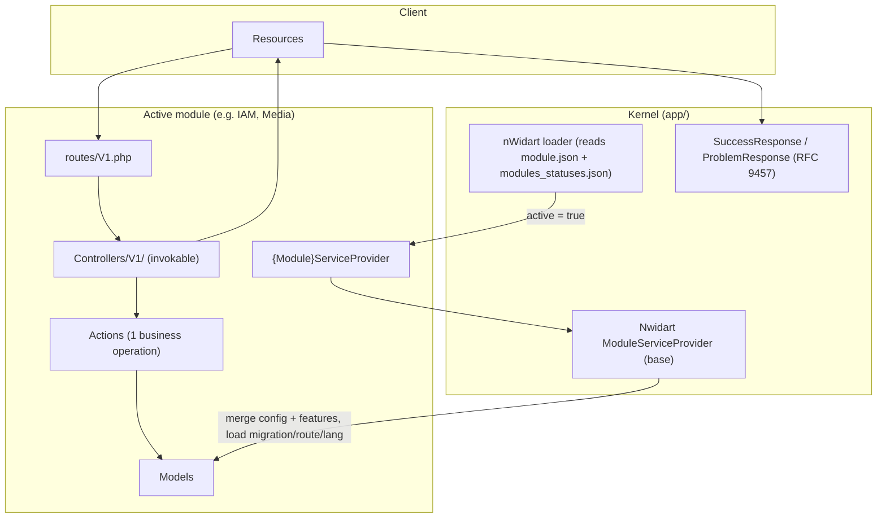
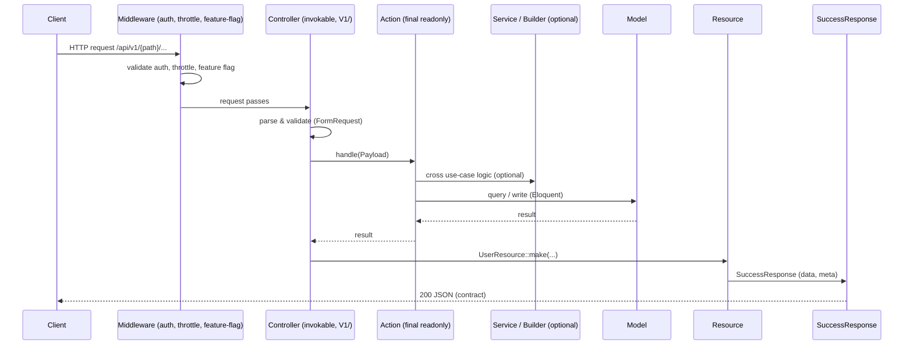
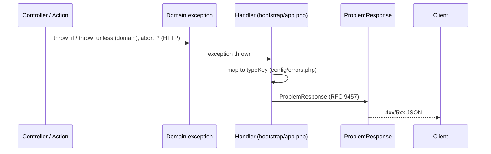
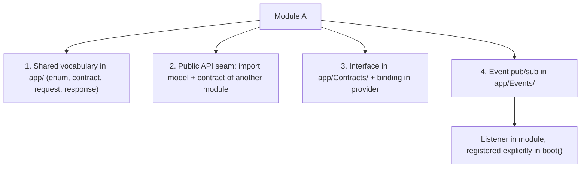
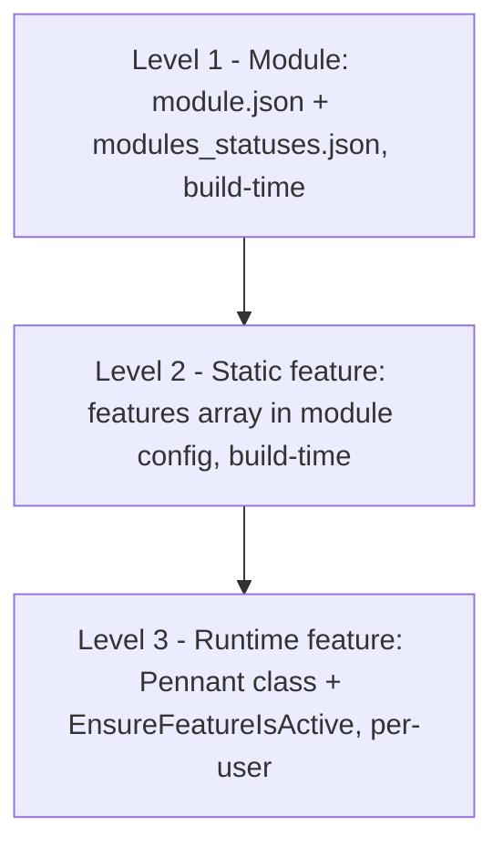
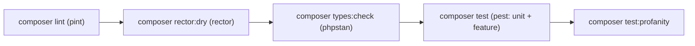

# Modularization Architecture: Laravel Starterkit API

Status: **Final**. This document is the restructured, enhanced derivative of the root `ARCHITECTURE.md` (Bahasa Indonesia, source of truth). `ARCHITECTURE.md` and `.ai/rules/` must stay in sync with this file. All decisions are explained directly here.

---

## 1. Executive Architecture Overview & Design Patterns

**This architecture** is a modular Laravel starterkit: every business capability lives inside one self-contained module, managed by the **nWidart/laravel-modules** package (activation via `modules_statuses.json`), and wires itself to the framework through one **service provider** per module.

**Three core ideas:**

- **Modules mirror `app/`** - adopters familiar with the Laravel layout understand a module without extra documentation.
- **Config-driven activation, no env** - no `MODULES_*` env overrides; active status and feature toggles are reviewable code decisions.
- **Native-first** - every wrapper keeps an escape hatch to the built-in Laravel API.

### Architecture Overview



### 1.1 Modules mirror the app structure (mirror principle)

The module folder structure mirrors the built-in `app/` structure, including the container folders `Http/` (Controllers, Middleware, Requests, Resources) and `Console/` (Commands) that host HTTP/CLI layers exactly like `app/Http` and `app/Console`.

- **Module-scoped** things live inside the module.
- **Shared** things live in `app/`.
- Inspiration: Nuxt Layers ("the layers structure is almost identical to a standard Nuxt application"), official Laravel package structure, nWidart/laravel-modules.

### 1.2 Config-driven activation, no env

Capabilities are enabled through nWidart FileActivator, **not** environment variables.

- `modules_statuses.json` holds the active status of each module (alias lowercase to boolean), managed via `php artisan module:enable {Module}` / `module:disable`.
- Module metadata (name, alias, priority, providers) lives in the module's own `module.json`.
- The activation is an **allow-list**: modules not enabled are fully inert, no auto-discovery.
- Inspiration: Laravel Fortify (`features` array in `config/fortify.php`), nWidart/laravel-modules (FileActivator).

### 1.3 Single-responsibility actions, wired by providers

- Business logic is an **action class** performing one business operation.
- The **service provider** does the wiring: registers config, actions, and routes to the framework.
- Every module has one provider (`modules/{Module}/app/Providers/{Module}ServiceProvider.php`) extending the nWidart base `Nwidart\Modules\Support\ModuleServiceProvider`.
- The nWidart loader boots providers of **ACTIVE** modules (from `module.json` + `modules_statuses.json`).
- Inspiration: Laravel Fortify (`app/Actions/Fortify/CreateNewUser.php`), nWidart/laravel-modules (one service provider per module).

### 1.4 Self-contained modules

- Migrations, factories, seeders, routes, requests, resources, and tests live inside the module.
- A module can be moved, deleted, or enabled **without touching files outside the module** (except its activation status in `modules_statuses.json`).
- Inspiration: nWidart/laravel-modules.

### 1.5 Shared vocabulary lives in app

- Contracts used across modules (interfaces, shared enums, response contract) live in `app/`.
- Modules do **not** import each other directly; they communicate through contracts.
- Inspiration: `shared/` in Nuxt Layers.

### 1.6 No per-module overhead

Deliberate deviation from nWidart/laravel-modules: modules keep the scaffold **minimal** (nWidart requires `module.json` + `composer.json` per module, generated by `module:make`), but custom module code stays close to plain Laravel classes. No per-module `resources/assets`, `vite.config.js`, or duplicated build tooling.

- **One repo, one dependency graph, one build.**
- Philosophy: production-ready, not overengineered.

### 1.7 Native-first escape hatch

- Every customization must preserve the native Laravel path.
- Adopters can always skip the wrapper and use the built-in API.
- Customizations make things easier, never block them.

---

## 2. Request Lifecycle & Data Flow

### 2.1 Successful request flow



### 2.2 Error flow



**Key rule:** the controller **never** writes error responses manually; all errors go through exceptions that the handler maps to `ProblemResponse`.

### 2.3 Module boot lifecycle

```mermaid
flowchart LR
    A["module.json + modules_statuses.json"] --> B{FileActivator (nWidart)}
    B -- "active = true" --> C["Register {Module}ServiceProvider (from module.json)"]
    B -- "active = false" --> D["Inert: provider, config, migration, route not loaded"]
    C --> E["Nwidart ModuleServiceProvider (register/boot)"]
    E --> F["Merge config/config.php of module"]
    E --> G["Merge features into config('{alias}.features')"]
    E --> H["Load migrations (modules/{Module}/database)"]
    E --> I["Load routes/V1.php (prefix api/{version})"]
    E --> J["Load app/Lang/{locale}"]
    E --> K["Register app/Console/Commands of module"]
    E --> L["boot() hook (middleware alias, feature, binding)"]
```

### 2.4 Inter-module communication (4 paths)



---

## 3. Directory Structure & Component Responsibilities

### 3.1 Project folder structure

```text
project/
├── app/                         # Shared code (shared vocabulary)
│   ├── Builders/                # BaseQueryBuilder (filter/sort/search/include whitelist)
│   ├── Concerns/                # Shared traits (HasDefaultBehavior, FormatDate, etc.)
│   ├── Console/
│   │   └── Commands/            # Global Artisan commands (module:make, security:check)
│   ├── Contracts/               # Cross-module interfaces (Identity)
│   ├── Enums/                   # Shared vocabulary enums (RoleEnum, PermissionEnum)
│   ├── Events/                  # Cross-module events (module A dispatches, module B listens)
│   ├── Features/                # Pennant class-based features used by 2+ modules
│   ├── Http/
│   │   ├── Controllers/         # Base Controller
│   │   ├── Middleware/          # Global: AddTraceId, AddSecurityHeaders, SetLocale, AddDeprecationHeaders, HandleIdempotentRequests
│   │   ├── Requests/            # Shared requests (PaginationRequest, BulkActionRequest)
│   │   └── Responses/           # SuccessResponse, ProblemResponse (RFC 9457)
│   ├── Jobs/                    # Queue jobs shared across modules
│   ├── Models/                  # Shared models (Sanctum PersonalAccessToken)
│   ├── Notifications/           # Shared notifications (VerifyEmail, ResetPassword)
│   ├── Payloads/                # Shared DTOs (IdempotencyPayload)
│   ├── Providers/               # AppServiceProvider, RouteServiceProvider
│   └── Support/                 # Global technical utilities (ProductionSecurityCheck)
├── config/                      # Global config (apiroute.php = supported API versions)
├── database/
│   ├── factories/               # Shared factories
│   ├── migrations/              # Shared migrations
│   └── seeders/                 # Shared seeders
├── modules/
│   └── {Module}/                # One module (TitleCase folder, lowercase alias)
│       ├── module.json          # nWidart metadata (name, alias, priority, requires, providers)
│       ├── composer.json        # nWidart scaffold (package metadata)
│       ├── app/                 # Mirrors app/: all module PHP code here
│       │   ├── Http/            # All HTTP layers here
│       │   │   ├── Controllers/ # V1/, V2/ for API versioning (invokable single-action)
│       │   │   ├── Middleware/  # Module-specific middleware
│       │   │   ├── Requests/    # V1/ (FormRequest validation)
│       │   │   └── Resources/   # API resource transformers
│       │   ├── Console/
│       │   │   └── Commands/    # Module-specific Artisan commands
│       │   ├── Exceptions/      # Module-specific exception classes
│       │   ├── Features/        # Module-specific Pennant class-based features (runtime flag)
│       │   ├── Jobs/            # Module-specific queue jobs
│       │   ├── Mail/            # Module-specific mail
│       │   ├── Rules/           # Module-specific custom validation rules
│       │   ├── Events/          # Module-specific events
│       │   ├── Listeners/       # Module-specific listeners
│       │   ├── Lang/            # {locale}/ (module translations, loaded when active)
│       │   ├── Models/          # Module Eloquent models
│       │   │   └── Scopes/      # Global scopes (registered via #[ScopedBy])
│       │   ├── Observers/       # Model observers (registered via #[ObservedBy])
│       │   ├── Policies/        # Module authorization policies (registered via #[UsePolicy])
│       │   ├── Providers/       # (required) {Module}ServiceProvider extends Nwidart base + RouteServiceProvider
│       │   ├── Notifications/   # Module-specific notifications
│       │   ├── Actions/         # Kit-specific: one business operation, final readonly, handle()
│       │   ├── Builders/        # Kit-specific: query builder, extends BaseQueryBuilder
│       │   ├── Services/        # Kit-specific: cross use-case logic
│       │   ├── Payloads/        # Kit-specific: action input DTOs
│       │   ├── Support/         # Kit-specific: pure technical utilities
│       │   ├── Contracts/       # Kit-specific: module-specific contracts
│       │   └── Enums/           # Kit-specific: module-specific enums
│       ├── config/              # Kit-specific: config.php (merged by base provider)
│       ├── database/            # Kit-specific: factories, migrations, seeders
│       ├── routes/              # (required) V1.php, V2.php (loaded by module RouteServiceProvider)
│       └── tests/               # (required) Module feature and unit tests
├── routes/
│   ├── api.php                  # Reserved; API routes registered by modules (routes/V1.php)
│   ├── console.php              # Console routes
│   └── web.php                  # Web routes
└── tests/                       # Global app tests
    ├── Architecture/            # Architecture tests (conventions)
    ├── Feature/                 # Infrastructure tests (middleware, responses, etc.)
    ├── Unit/                    # App unit tests
    └── Helpers.php              # Seam for accessing module models (not direct imports)
```

**Mirror principle (1.1):** `modules/{Module}/app/` is a mirror of the built-in `app/` skeleton; the container folders `Http/` and `Console/` host HTTP/CLI layers exactly like `app/Http` and `app/Console`.

- Only 3 folders are **required** on an ACTIVE module: `app/Providers`, `routes`, `tests` (+ nWidart metadata `module.json`, `composer.json`).
- The rest are **optional**, created when needed.
- Kit-specific layers without a skeleton counterpart: Actions, Services, Payloads, Builders, Features, config, database, routes, tests, Lang.
- `app/Http/Responses` is a global contract and is **not mirrored** into modules.

### 3.2 Folder matrix

**Required folders (present on ACTIVE modules):**

| Folder | Contents |
|---|---|
| `app/Providers` | `{Module}ServiceProvider` extends nWidart base `ModuleServiceProvider` + `RouteServiceProvider` |
| `routes` | Route file (`V1.php`) |
| `tests` | Feature and unit tests |

**Optional folders (only created if they contain at least 1 file; empty folders forbidden):**

| Folder | Contents |
|---|---|
| `app/Http` | Controllers, Middleware, Requests, Resources (mirror `app/Http`) |
| `app/Console` | Commands (mirror `app/Console`) |
| `app/Exceptions` | Module-specific exception classes |
| `app/Features` | Pennant class-based features (runtime flag) |
| `app/Jobs` | Module-specific queue jobs |
| `app/Mail` | Module-specific mail |
| `app/Rules` | Module-specific custom validation rules |
| `app/Events` | Module-specific events |
| `app/Listeners` | Module-specific listeners |
| `app/Lang` | Module translations (`{locale}/`) |
| `app/Models` | Eloquent models |
| `app/Observers` | Model observers (via `#[ObservedBy]`) |
| `app/Policies` | Authorization policies (via `#[UsePolicy]`) |
| `app/Models/Scopes` | Global scopes (via `#[ScopedBy]`) |
| `app/Notifications` | Module-specific notifications |
| `app/Actions` | Business logic, one operation per class |
| `app/Builders` | Query builders (extends `BaseQueryBuilder`) |
| `app/Services` | Cross use-case logic |
| `app/Payloads` | Action input DTOs |
| `app/Support` | Pure technical utilities |
| `app/Contracts` | Module-specific contracts |
| `app/Enums` | Module-specific enums |
| `config` | `config.php` (merged by nWidart base provider) |
| `database` | factories, migrations, seeders |

**Inactive modules** (not enabled in `modules_statuses.json`) minimally contain `app/Providers`, `tests`. Example: `Organization`. The rest of the structure appears when the module is activated.

### 3.3 Inspiration and deviations

| Aspect | Nuxt Layers | Laravel Fortify | nWidart/laravel-modules | Kit decision |
|---|---|---|---|---|
| Module structure | Mirror standard app | Structured package | app/ + resources + vite | Mirror app/ (`app/Http/` container) |
| Activation | Config layer | Config features array | FileActivator (modules_statuses.json) | FileActivator + module.json (allow-list) |
| Module metadata | nuxt.config | - | module.json inside module | module.json inside module |
| Feature toggle | - | features array | - | config features (build-time) + Pennant class (runtime) |
| Business logic | Composables/utils | Actions | Service classes | Actions + Services |
| DB resources | - | Migrations via publish | Migrations/factories/seeders in module | Inside the module |
| Per-module overhead | nuxt.config | composer package | composer.json + module.json | Minimal scaffold (module.json + composer.json only) |
| Shared code | shared/ | Vendor namespace | Modules namespace | app/ (shared vocabulary) |
| Repositories | - | - | Repositories layer | NOT used (Eloquent is the repository) |

**Decision note:** the kit disables frontend scaffolding in the generator: the `views`, `assets`, and `vite` stubs are commented out in `config/modules.php` (marked "TODO: support frontend"), so generated modules are backend-only. There is no `--repository` flag on `module:make` (nwidart v13); repositories are on-demand via `module:make-repository` when a real use case appears (Eloquent is the repository). `--event` is kept (`Events/` optional, created when needed). Executed during generator implementation.

**Decision note (generator alignment):** the generator paths in `config/modules.php` are aligned with this anatomy: interfaces map to `app/Contracts` (namespace `Contracts`), emails to `app/Mail` (namespace `Mail`), resources to `app/Http/Resources` (namespace `Http/Resources`), commands to `app/Console/Commands` (namespace `Console/Commands`), lang to `app/Lang`, and helpers to `app/Support` (namespace `Support`). Global scopes generate into `app/Models/Scopes` (nwidart derives the scope namespace from the model path, so the docs mirror that location instead of moving the path). The remaining nwidart extras (casts, channels, classes, traits, components, replacements, plain classes) stay at vendor defaults and are outside the anatomy; repositories stay on-demand. All PHP stubs carry `declare(strict_types=1)` and follow kit conventions: model stubs are attribute-based (`#[Fillable]`, `#[Hidden]`, `#[UseFactory]`) and non-final, commands use `#[Signature]`/`#[Description]` with `handle(): int`, actions/services are `final readonly`, and controller stubs return `SuccessResponse`. Verified end-to-end with `module:make {Name}` plus layer commands against a scratch module.

---

## 4. Strict Boundaries & Guardrails

### 4.1 Module isolation & dependencies

**Mandatory rules:**

1. Modules communicate through **contracts or the public API seam**, not imports of another module's internal classes.
2. `app/Contracts` is only for interfaces used by **2+ modules** or core.
3. Eloquent models and contracts = the module's **public API seam**: they may be imported directly by other modules (existing example: Media module imports `Modules\IAM\Models\User`, `Role`, `Permission`).
4. Internal classes (Actions, Services, Payloads, Support, Builders, Enums) **must not** be imported across modules.

**Four inter-module communication paths (most preferred first):**

1. **Shared vocabulary in `app/`**: shared enums, contracts, shared requests, response contract used by 2+ modules without cross-module imports.
2. **Public API seam**: models + contracts of another module may be imported directly - Eloquent data + relations (example: `Media::uploadedBy()` imports `Modules\IAM\Models\User`), authorization (`MediaPolicy` type-hints `User` + `App\Enums\PermissionEnum`), seeders (`MediaSeeder` firstOrCreate `Role`/`Permission` from IAM).
3. **Contract for cross-module behavior**: interface in `app/Contracts/` implemented by the owning module and bound in the provider (example: `Identity` abstracts the auth actor).
4. **Event pub/sub for loose coupling**: shared event classes in `app/Events/` (module A dispatches), listeners in the listening module registered explicitly in `boot()`; global listeners in `app/Listeners` are auto-discovered.

**Direct model vs interface:**

- Eloquent data + relations: **direct model** (Eloquent needs a concrete class, `belongsTo(User::class)`); interfaces cannot be used for relations.
- Behavior/decoupling/2+ possible implementations: **interface** in `app/Contracts/` (example: `Identity`).
- Exactly 1 implementation, guaranteed not to become 2+: **direct model** is enough; an interface is YAGNI.

**Base class/interface rule of thumb per layer:** only if (1) there is logic executed together, (2) real polymorphism/decoupling is needed, (3) it is a cross-module contract, (4) container binding. Forbidden for the sake of "consistency" alone; structural conventions are enforced by ArchitectureTest, not inheritance.

### 4.2 Database rules

1. Enum values as column defaults (`->default(StatusEnum::Pending->value)`).
2. **Forbidden** to chain migration commands with `&&` or `;` (identical timestamps).
3. Factory + Seeder for every model.
4. Schema changes = **review gate** (requires approval).
5. Module seeders are executed via `php artisan db:seed --class=Modules\{Module}\database\Seeders\{Name}Seeder` or from `database/seeders/DatabaseSeeder`; **forbidden** for a seeder to call another module's seeder (dependencies are seeded sequentially by the caller, example: `MediaSeeder` does not call `IAMSeeder`).
6. Module migration rollback via `php artisan migrate:rollback --path=modules/{Module}/database/migrations` (without `--path`, rollback only targets the last global batch).

**Forbidden:** editing schema without approval; migrations outside a module.

### 4.3 Error handling & exception helpers

**Definition:** errors are communicated via exceptions and mapped to `ProblemResponse` (RFC 9457) by the handler in `bootstrap/app.php`. Laravel's `abort*`/`throw*` helpers are used per layer to avoid try/catch boilerplate.

| Layer | Helper | Exception / status |
|---|---|---|
| HTTP (controller, middleware, request) | `abort`/`abort_if`/`abort_unless` | HTTP conditions (403, 404, 409) |
| Domain (Action, Payload, Support) | `throw_if`/`throw_unless` | `InvalidArgumentException` (422), `ModelNotFoundException` (404, ownership checks), custom exceptions in `Exceptions/` when a specific status/type is needed |

**Rules:**

1. Exception-to-`ProblemResponse` mapping happens only in the handler; the controller **never** writes error responses manually.
2. Error messages via translation keys `__()`, not hardcoded strings.
3. Lookups that must exist use `findOrFail`/`firstOrFail`/`valueOrFail` (throws `ModelNotFoundException` to 404); **do not** use `updateOrFail`/`deleteOrFail`/`saveOrFail` as lookup substitutes (they all silently return false when the model does not exist).

**Forbidden:** `abort*` in the domain layer; try/catch in controllers to map errors; hardcoded error messages in throws.

### 4.4 Cross-module conventions

1. **Response contract**: `SuccessResponse` / `ProblemResponse` (RFC 9457), no `success` boolean; error type from `config/errors.php` typeKey.
2. **Date format** for all response fields: `Y-m-d H:i:s`.
3. **`declare(strict_types=1)`** in every PHP file.
4. **PHP 8 attributes** preferred over properties (model, job, command).
5. **Route naming** `api.{version}.{module}.{name}`; module lowercase in `modules_statuses.json`.
6. **Operational classes**: `final readonly`; use constructor property promotion.
7. **Documents** (docs, rules, roadmap): pure ASCII, no emoji, no em/en dash, no arrows, use hyphens.
8. **Code and comment language**: English.

---

## 5. Layer Responsibilities

Each layer: definition, rules, forbidden, example.

### 5.1 Actions

**Definition:** `final readonly` classes performing ONE business operation, called by controllers, other actions, or services. Inspiration: Fortify Actions.

**Rules:**

1. `final readonly`, one public `handle()` method, explicit parameter types.
2. Does **NOT** accept `Request`; the controller extracts data and passes it on.
3. Does **NOT** write HTTP logic (status codes, redirects, json).
4. Validation happens in the Request layer, not in the action.
5. Every action has a unit test in `modules/*/tests/Unit`.
6. Business errors via `throw_if`/`throw_unless` + domain exceptions (`InvalidArgumentException` mapped to 422, `ModelNotFoundException` to 404 for ownership checks).
7. Multi-step related writes (2+ writes) **must** be wrapped in `DB::transaction` or equivalent (`saveOrFail`/`deleteOrFail` for instances, `syncOrFail`/`attachOrFail` etc. for pivots); single-model writes use plain `create`/`update`/`save`/`delete`.
8. **NO** base class/interface for Actions: the structure (`final readonly`, `handle()`) is a convention enforced by ArchitectureTest, not inheritance (principle 1.6); interfaces only for real cross-module polymorphism.

**Forbidden:**

- Public methods other than `handle()`.
- HTTP dependencies (Request, Response).
- Eloquent queries with inline domain conditions in controllers; queries live in actions or builders. Pure queries (paginate + filter/search/sort whitelist BaseQueryBuilder, no domain conditions) are allowed directly in controllers.
- HTTP helpers (`abort`, `abort_if`, `abort_unless`) in actions.
- `createOrFail` (does not exist in the framework) and `updateOrFail`/`deleteOrFail` as lookups (silently return false when the model does not exist).

**Example:**

```php
final readonly class CreateUserAction
{
    public function handle(UserPayload $payload): User
    {
        return User::create($payload->toArray());
    }
}
```

### 5.2 Controllers

**Definition:** `final readonly` invokable single-action classes in `modules/{Module}/app/Http/Controllers/V1/`. They only handle HTTP concerns: parse the request, call the action, return the response.

**Rules:**

1. `final readonly`, extend the base `Controller`, one `__invoke(Request|FormRequest $request): SuccessResponse` method; the parameter may type-hint a FormRequest subclass (example: `RegisterController`); errors are not returned by the controller but thrown as exceptions mapped by the handler to `ProblemResponse`.
2. Delegate logic to an Action via `->handle()`.
3. Pure queries (paginate + filter/search/sort whitelist BaseQueryBuilder, no domain conditions) are allowed directly in the controller.
4. Return type-hint `SuccessResponse` (all existing controllers are consistent, 0 uses of `JsonResponse`); `ProblemResponse` is only written by the handler.
5. Follow the structure of existing sibling controllers.

**Forbidden:** queries with domain conditions in controllers (must go through Actions); business logic; non-contract responses.

**Example:**

```php
final readonly class RegisterController extends Controller
{
    public function __invoke(RegisterRequest $request): SuccessResponse
    {
        $user = (new CreateUserAction)->handle(UserRegistrationPayload::fromRequest($request));

        return new SuccessResponse(
            data: UserResource::make($user),
            status: Response::HTTP_CREATED,
        );
    }
}
```

### 5.3 Models

**Definition:** Eloquent models in `modules/{Module}/app/Models/`. Data access belongs to the module.

**Rules:**

1. ULID primary key via `HasDefaultBehavior` (HasUlids + serializeDate `Y-m-d H:i:s`).
2. Attributes via PHP 8 attributes: `#[Fillable]`, `#[Hidden]`, `#[UseFactory]`, `#[UseEloquentBuilder]`.
3. Model-related registrations via attributes: `#[UsePolicy]` (policy), `#[ObservedBy]` (observer), `#[ScopedBy]` (global scope).
4. `#[Table]`, `#[UseResource]`, `#[UseResourceCollection]` only for convention deviations (non-standard table, pivot, non-standard resource naming).
5. Cast enum columns to enum classes (`'status' => StatusEnum::class`).
6. `declare(strict_types=1)` in every file.
7. A factory is required for every model.
8. The app layer (tests/) accesses module models only through the seam `tests/Helpers.php`, not direct imports.
9. Soft deletes use the `Illuminate\Database\Eloquent\SoftDeletes` trait (the `#[UseSoftDeletes]` attribute does not exist in Laravel 13); `withTrashed`/`onlyTrashed` queries only in actions/builders.

**Forbidden:** UUID primary keys; `$fillable`/`$hidden` properties; cross-module models.

### 5.4 Services

**Definition:** business logic used by 2+ call-sites or orchestrating complex flows across use cases. Difference from Action: **Action = 1 use case; Service = shared logic.**

**Rules:**

1. `final readonly`, dependencies injected via constructor.
2. Does NOT accept `Request`.
3. May call Actions and models.
4. Minimum 2 call-sites or a complex flow; a 1 call-site service must be converted to an Action.

**Forbidden:** services for 1 call-site; services calling controllers/HTTP layer.

**Example:** `UserAuthorizationService` (determines token abilities and creates the access token, used by login and register).

### 5.5 Support

**Definition:** pure technical utilities, self-contained, no business state and no Eloquent dependency.

**Rules:**

1. Static or `final readonly`, purely technical (crypt, format, technical validation).
2. If it has business logic, it is a Service; if 1 use case, it is an Action.
3. Not called directly from controllers (via Service/Action).

**Forbidden:** Eloquent dependencies; domain business logic.

**Example:** `SocialState` (creates and verifies OAuth state tokens with expiry).

### 5.6 Builders

**Definition:** custom Eloquent query builders registered via `#[UseEloquentBuilder]`.

**Rules:**

1. `BaseQueryBuilder` is the single mechanism for filter, search, sort, include whitelists.
2. Whitelist methods: `allowedSearch`, `allowedFilters`, `allowedSorts`, `allowedFields`, `allowedIncludes`.
3. Models register the builder via attribute, not `newBuilder()`.
4. Native Eloquent (`where`, `orderBy`, scopes) remains valid in actions/builders.

**Forbidden:** query-string parsing in controllers; bypassing whitelists with arbitrary parameters.

**Example:**

```php
User::query()
    ->with(['roles'])
    ->allowedSearch()
    ->allowedFilters()
    ->allowedSorts()
    ->allowedFields()
    ->allowedIncludes()
    ->paginate();
```

### 5.7 Payloads

**Definition:** immutable `final readonly` DTOs with constructor promotion, input for actions.

**Rules:**

1. `final readonly`, typed properties, constructor promotion.
2. Validation stays in Requests; Payloads do not validate.
3. Used for data across layers (Request to Action, queue jobs, CLI).

**Forbidden:** payloads with validation logic; mutable payloads.

### 5.8 Requests

**Definition:** one FormRequest per endpoint in `modules/{Module}/app/Http/Requests/V1/`. Cross-module requests (pagination, bulk action) live in `app/Http/Requests/` (shared).

**Rules:**

1. One FormRequest per endpoint/action; the only exceptions are shared requests in `app/Http/Requests/` (`PaginationRequest`, `BulkActionRequest`) used across endpoints.
2. Validation in the `rules()` method; authorization via `authorize()` or policy/permission.
3. No inline validation in controllers.
4. List endpoints **must** type-hint `{Resource}ListRequest` in the module extending `App\Http\Requests\PaginationRequest` (not PaginationRequest directly): the place for `authorize()` permission and extra filter/sort/search rules; an empty subclass is allowed when only pagination is needed (existing pattern: `UserListRequest`, `RoleListRequest`, `PermissionListRequest`, `DeviceListRequest` in `modules/IAM/Requests/V1/`).
5. Request naming follows the controller: `{Resource}ListRequest` for `{Resource}ListController`.

**Forbidden:** long validation arrays in controllers; Requests calling models directly; list controllers type-hinting `PaginationRequest` directly from app.

### 5.9 Resources

**Definition:** API resource transformers in `modules/{Module}/app/Http/Resources/`.

**Rules:**

1. `extends JsonResource`, contract envelope via SuccessResponse.
2. Date format `Y-m-d H:i:s`.
3. Resources belong to the module; the app-wide shape is global.

**Forbidden:** resources changing the global envelope structure.

### 5.10 Policies

**Definition:** per-module authorization policies, registered via `#[UsePolicy]` on the model (single source of truth, no hidden registration in providers); manual `Gate::policy` in providers is **NOT** used for modules.

**Rules:**

1. One policy per model when resource authorization exists.
2. Registration via the `#[UsePolicy(Policy::class)]` attribute on the model.
3. Use Spatie permissions inside policies.

**Forbidden:** `Gate::policy` in module service providers; hidden authorization inside controllers; two sources of truth at once (Spatie permission OR Sanctum abilities, pick one per route).

### 5.11 Providers

**Definition:** `modules/{Module}/app/Providers/{Module}ServiceProvider.php` wires the module to the framework. Every module provider extends the nWidart base `Nwidart\Modules\Support\ModuleServiceProvider`; the nWidart loader boots providers of **ACTIVE** modules (from `module.json` + `modules_statuses.json`).

**Rules:**

1. The nWidart base class provides loading boilerplate: merge `config/config.php`, load migrations, load factories, register providers from the `$providers` array (EventServiceProvider, RouteServiceProvider). No `withCommands` in `bootstrap/app.php`; module commands are registered via the base's `registerCommands`.
2. Module providers only declare: `$name`, `$nameLower`, the `$providers` array, and the `boot()` hook for middleware aliases, Pennant features, bindings (policies via `#[UsePolicy]` on models).
3. Module activation through nWidart FileActivator (`modules_statuses.json`); a non-enabled module = provider never boots.
4. No hidden registrations; middleware aliases registered explicitly, not via magic discovery.
5. The module alias is lowercase module name (`'Media'` becomes `'media'`); the alias is used for the config key (`config('media.*')`) and the route name prefix (`api.v1.media.`, 5.17).
6. `OrganizationServiceProvider` is the exception: extends stancl `TenancyServiceProvider` (not the base) because tenancy is opt-in via its own provider lifecycle.

**Forbidden:** module providers extending `ServiceProvider` directly (must extend nWidart base `ModuleServiceProvider`); providers registering routes outside `routes/`; `env()` in providers.

### 5.12 Middleware

**Definition:** module-specific middleware in `modules/{Module}/app/Http/Middleware/`; global middleware in `app/Http/Middleware/`.

**Rules:**

1. Middleware used only by specific module routes lives in the module.
2. Global middleware (auth, throttle, security headers) lives in app.
3. Middleware aliases registered explicitly, not via magic discovery.

**Forbidden:** global middleware inside modules; middleware without aliases.

### 5.13 Enums

**Definition:** module-specific enums in `modules/{Module}/app/Enums/`; shared vocabulary enums (used by 2+ modules) in `app/Enums/`.

**Rules:**

1. 1 module call-site only: in the module. 2+ modules: in app.
2. TitleCase values; native labels via methods (no label library dependency).
3. Cast models to enum classes.

**Forbidden:** module-specific enums living in `app/Enums`; shared enums living in a module.

### 5.14 Config

**Definition:** global config in `config/`; module config in `modules/{Module}/config/config.php` (merged by the nWidart base provider, accessed via lowercase alias `config('iam.*')`).

**Rules:**

1. Module config is merged by the provider when the module is active.
2. Access config via typed helpers (`config()->integer(...)`) to preserve types.
3. Fortify-style features array.

**Forbidden:** `env()` outside config files; module config loaded while the module is inactive.

### 5.15 Notifications

**Definition:** notifications in `app/Notifications/` (global) or `modules/{Module}/app/Notifications/` (module-specific).

**Rules:** queue-able via `ShouldQueue`; descriptive naming (VerifyEmail, ResetPassword).

**Forbidden:** notifications called directly in controllers (via action/service).

### 5.16 Commands

**Definition:** Artisan commands in `app/Console/Commands/` (global) or `modules/{Module}/app/Console/Commands/` (module-specific).

**Rules:**

1. PHP 8 attributes: `#[Signature]`, `#[Description]`, `#[Help]`, `#[Usage]`.
2. `handle(): int` with exit code.
3. Module commands are registered by adding the command class to the `$commands` array in the module's `{Module}ServiceProvider` (the nWidart base `ModuleServiceProvider` registers whatever is listed there; it does not auto-discover the folder); global commands in `app/Console/Commands` are auto-discovered

**Forbidden:** commands without attribute signatures.

### 5.17 Routes

**Definition:** module route files in `modules/{Module}/routes/V1.php`, loaded by the module's own `RouteServiceProvider` (in the `$providers` array) when the module is active. The provider extends `Illuminate\Foundation\Support\Providers\RouteServiceProvider`, iterates `apiroute.supported_versions` (default `['V1']`), guards with `file_exists`, and mounts `api/{version}` with name prefix `api.{version}.{alias}.`.

**Rules:**

1. Base prefix `api/v1/{path}` (no module segment in the URL); route name `api.{version}.{module}.{name}`.
2. Explicit middleware on route groups (auth:sanctum, throttle, permission, feature-flag).
3. Route files are only loaded when the module is active.

**Forbidden:** route registration outside `routes/`; hidden middleware in providers.

### 5.18 Features

**Definition:** module feature flags. **Build-time toggle**: `features` array in the module's `config/config.php` (merged into `config('{alias}.features')`). **Runtime per-user**: Pennant classes in `modules/{Module}/app/Features/` (used by 2+ modules: `app/Features/`), checked via `EnsureFeatureIsActive`.

**Rules:**

1. Build-time: boolean values in the module config; merged by the nWidart base provider into `config('{alias}.features')`.
2. Runtime: `final class {Feature} extends Feature`, `resolve()` holds per-user logic.
3. Naming: `{module}.{feature}` (e.g. `iam.self-registration`).
4. Unregistered features are considered off (default false).

**Forbidden:** `env()` for feature toggles; two sources of truth (config vs Pennant for the same thing).

### 5.19 Bulk actions

**Definition:** mass mutation endpoints (delete, restore) processing many ids at once. Shared request `App\Http\Requests\BulkActionRequest` (validates `ids` max 50 + `action`); the controller delegates to an Action; the Action executes one bulk query.

**Rules:**

1. `BulkActionRequest` (shared) required for all bulk endpoints; per-action authorization via `authorize()` based on route name.
2. Bulk Action = one `whereIn` query (delete/restore), returns count.
3. `Bus::bulk`/`Bus::batch` is **NOT** used for synchronous mutations; only for heavy per-item processing needing a queue (no use case yet; rule added when one appears).
4. Routing: `POST /{resource}/bulk/{action}`, route name `api.{version}.{module}.{resource}.bulk.{action}`.
5. Note: bulk queries do not trigger model events/observers per row (deliberate trade-off).

**Forbidden:** dispatching one job per item for simple delete/restore; query loops in controllers (loops, when needed, only in Actions).

### 5.20 On-demand layers (Jobs, Events, Listeners, Mail, Rules, Exceptions, Lang, Observers, Scopes)

**Definition:** optional folders that live in the module when needed, following Laravel conventions: Jobs (queue jobs), Events + Listeners (event bus), Mail (email), Rules (custom validation rules), Exceptions (module-specific exception classes), `app/Lang/{locale}` (module translations), Observers (model observers via `#[ObservedBy]`), Scopes (global scopes via `#[ScopedBy]`).

**Rules:**

1. Created only if they contain at least 1 file (empty folders forbidden).
2. `app/Lang/` is loaded by the nWidart base `ModuleServiceProvider` when the module is active.
3. Detailed rules simply follow Laravel conventions; no separate rule file per folder.
4. Module listeners are NOT auto-discovered (bootstrap only scans `app/Listeners`); register listeners explicitly in `boot()` via `Event::listen`/`Event::subscribe`.

**Forbidden:** empty folders as placeholders.

---

## 6. Module Lifecycle

### 6.1 Creating a module

```bash
php artisan module:make Blog
```

The nWidart generator (stub kit in `stubs/module-generator/`) creates the structure: `module.json`, `composer.json`, `config/config.php`, `routes/V1.php`, `app/Providers/*`, `app/Http/Controllers/{Module}Controller.php`, `database/seeders/`, `tests/`. Options: `--api`, `--disabled`, `--plain`. Optional layers are added when needed (not up front).

### 6.2 Activating a module

Activation status lives in `modules_statuses.json` (nWidart FileActivator), managed via Artisan commands:

```bash
php artisan module:enable Blog    # or module:disable
```

`module.json` inside the module holds metadata (name, alias, priority, providers). `modules_statuses.json` maps lowercase aliases to booleans:

```json
{
  "iam": true,
  "media": true,
  "organization": false
}
```

**How it works:**

1. The nWidart loader reads `module.json` + `modules_statuses.json`: enabled modules register their provider.
2. The base `ModuleServiceProvider` merges config + features, then loads migrations, routes, and translations.
3. Non-enabled modules are **fully inert**: provider, config, migrations, routes are not loaded (proven by tests).

**Boot order** across modules follows `priority` in `module.json` (default 0); the key is only used when a real cross-module boot dependency appears.

### 6.3 Deactivating a module

`php artisan module:disable {Module}` (status `false` in `modules_statuses.json`). Module data stays in the database (migrations are not rolled back automatically); the schema stays, behavior is off.

### 6.4 Declaring module dependencies

`module.json` carries an optional `requires` array listing the module names a module depends on (TitleCase folder names):

```json
{
    "name": "Media",
    "alias": "media",
    "priority": 0,
    "requires": ["IAM"],
    "providers": ["Modules\\Media\\Providers\\MediaServiceProvider"]
}
```

The core module (IAM) declares none. Validate the declarations with:

```bash
php artisan module:check-dependencies
```

The command fails when a declared dependency is not an installed module, is disabled, or when the `requires` graph contains a cycle. A module must not declare a dependency on a module that is not registered in the `config/modules.php` allow-list. New modules are scaffolded with an empty `"requires": []` by the generator.

### 6.5 Private modules

Private module folders are stored on disk + added to `.gitignore` + not enabled in `modules_statuses.json`. Never sent to a public repo.

### 6.6 Special case: Organization (tenancy)

Organization is a minimal inactive module (`app/Providers`, `tests`) wrapping stancl/tenancy (opt-in tenancy option). Deliberate deviations:

- The tenant model uses **UUID** (stancl default), a deviation from the ULID rule, confined to the module.
- Config `tenancy.php` inside the module.
- The rest of the structure grows when the module is activated (MVP 2).

### 6.7 Deleting a module

`php artisan module:delete {Module} --force` (removes the folder + status in `modules_statuses.json`). The provider is not booted when the module is non-enabled; an absent folder is not fatal. Database data remains (migrations are not auto-rolled back).

---

## 7. Toggle & Native-First

### 7.1 3-level toggle model



| Level | Mechanism | Timing | Example |
|---|---|---|---|
| Module | `modules_statuses.json` (FileActivator, `module:enable`/`disable`) | Build-time | `organization` off = tenancy inert |
| Feature (static) | `features` array in module `config/config.php` (Fortify-style) | Build-time | Media: upload vs signedUrl |
| Feature (runtime) | Pennant flags (classes in `app/Features/`) + EnsureFeatureIsActive | Runtime, per-user | beta flag, gradual rollout |

### 7.2 Draft code: module config

```php
// modules/Media/config/config.php
return [
    'name' => 'Media',
    'features' => [
        'upload'     => true,
        'signed-url' => false,
    ],
];
```

The nWidart base `ModuleServiceProvider` merges the config into `config('media.*')` at boot (including `features`); the module provider only declares + hooks:

```php
// modules/Media/app/Providers/MediaServiceProvider.php
final class MediaServiceProvider extends ModuleServiceProvider
{
    protected string $name = 'Media';

    protected string $nameLower = 'media';

    public function boot(): void
    {
        parent::boot();

        if (MediaFeatures::enabled(MediaFeatures::signedUrl())) {
            // register signed URL routes or middleware only when enabled
        }
    }
}
```

```php
// modules/Media/app/Support/MediaFeatures.php
final class MediaFeatures
{
    public static function upload(): string
    {
        return 'upload';
    }

    public static function signedUrl(): string
    {
        return 'signed-url';
    }

    public static function enabled(string $feature): bool
    {
        return config()->boolean("media.features.{$feature}", false);
    }
}
```

### 7.3 Pennant classes (runtime, per-user)

Features that need a runtime decision (per user, gradual rollout) are defined as Pennant classes in `modules/{Module}/app/Features/`:

```php
// modules/Media/app/Features/MediaUpload.php
final class MediaUpload extends Feature
{
    public function resolve(User $user): bool
    {
        return $user->hasRole(RoleEnum::SuperAdmin); // runtime per-user decision
    }
}
```

Routes are protected by the `feature-flag` middleware (EnsureFeatureIsActive). Features used by 2+ modules live in `app/Features/`.

**Note:** Pennant classes are only for runtime decisions (per-user, gradual rollout); static toggles simply use the features array in the module config without a Pennant class.

### 7.4 Chisel markers

The `/* @chisel-{feature} */` and `/* @end-chisel-{feature} */` pattern (from the vue-starter-kit Laravel) is **DEFERRED**: decision follows the `laravel/chisel` evaluation (backlog). Not adopted yet.

### 7.5 Native-first

Every wrapper must have a documented native escape hatch:

- **BaseQueryBuilder**: actions may still use plain `User::query()->where(...)` on models with a custom builder attached; the builder never blocks native Eloquent (scopes, eager loading, plain where clauses).
- **PersonalAccessTokenBuilder**: Sanctum's default token model remains usable; the builder only adds convenience methods.
- **Responses**: controllers may still return `response()->json(...)` directly; the exception handler still maps exceptions to problem details.
- **Middleware**: opt-in middleware (`feature-flag`, `idempotency`, `sunset`) only runs on routes that declare them; routes may skip them when not needed. Global middleware (`AddTraceId`, `AddSecurityHeaders`, `SetLocale`) attaches to the `api` group only.
- **Module provider**: a module provider may extend `Illuminate\Support\ServiceProvider` directly instead of the nWidart base class.
- **Identity contract**: any `Authenticatable` model can replace the `Identity` implementation; the contract only composes native Laravel auth interfaces.
- **Concerns (FormatDate, HasDefaultBehavior)**: traits are optional; models work without them.
- **Payloads / validation rule helpers**: native inline validation and native request handling remain valid.
- **EnsureEmailIsVerified**: the `verified` alias overrides Laravel's native middleware to throw `401`/`403` problem responses instead of redirecting to a web verification route (API-only deviation); teams with web flows can register the native middleware instead.

**Proof:** tests proving the native path still works (`tests/Feature/Builders/EloquentNativePathTest.php`, `tests/Feature/Http/Middleware/NativePathMiddlewareTest.php`, exception handler tests, module activation tests).

---

## 8. Testing & Deployment Strategy

### 8.1 Testing rules

1. **Placement**: module tests in `modules/*/tests/` (Feature, Unit); shared app tests in `tests/` (Feature, Unit, Architecture).
2. **Test folder structure** - module tests:
   ```text
   modules/{Module}/tests/
   ├── Feature/                  # HTTP feature tests (controllers, policies, middleware)
   │   └── V1/                   # optional: mirrors Http/Controllers/V1 when versioned
   └── Unit/                     # isolated unit tests (actions, enums, builders, services)
   ```
   Shared tests:
   ```text
   tests/
   ├── Architecture/             # ArchitectureTest - single source of truth for conventions
   ├── Datasets/                 # shared named datasets (2+ uses)
   ├── Feature/                  # shared feature tests (app infrastructure, middleware, registry)
   ├── Unit/                     # shared unit tests (responses, builders, enums, notifications)
   ├── Expectations.php          # custom Pest expectations
   ├── Helpers.php               # typed helpers seam (assertSuccessResponse, loginAsUser, ...)
   ├── Pest.php                  # groups, RefreshDatabase, beforeEach
   └── TestCase.php              # base test case
   ```
3. **Supported suites (current)**: `unit`, `feature`, and `profanity`. Coverage, mutation, and type-coverage gates are temporarily suspended (scripts removed); re-enable once the suite stabilizes.
4. **Composer scripts**: `composer test` (pest, unit + feature) and `composer test:profanity` are the main testing commands. `composer test:quality`, `composer test:mutation` are removed for now.
5. **Groups**: shared tests are grouped in `tests/Pest.php` (`app`, `feature`, `unit`, `arch`); module tests tag `->group('module:{name}')` per test plus the `feature`/`unit` group from `tests/Pest.php`. Filter with `vendor/bin/pest --group=app` (shared only), `--group=feature` (all feature tests), `--group=module:iam` (IAM only). See https://pestphp.com/docs/grouping-tests
6. **Imports**: shared tests MAY import module classes directly (models, factories, seeders, contracts, enums) - ArchitectureTest allows `Tests` to use `Modules\*\*`. `tests/Helpers.php` stays as a convenience seam for shared helpers, not a hard boundary. Module tests stay self-contained in `modules/*/tests/` and may import their own module plus other modules' public API seam (models, contracts).
7. **Writing tests**: follow the pest-testing skill: feature-first, factories over manual creation, datasets to avoid duplication, specific assertions, fakes over mocks. See https://github.com/matula/laravel-claude-marketplace/tree/main/pest-testing
8. **ArchitectureTest** (`tests/Architecture/ArchitectureTest.php`) is the single source of truth for conventions; assertion changes require human approval (report first, do not auto-fix).
9. **Quality gates**: `composer lint`, `composer rector:dry`, `composer types:check`, `composer test`, `composer test:profanity`, `composer ci:check`.

### 8.2 Quality flow (quality gates)



---

## 9. Mapping to Rules

This document is broken down into `.ai/rules/` (standard format: frontmatter paths + Goal + Rules + Forbidden + Example) as an enforced derivative. 25 rule files already exist; the mapping below is a **living mapping** that must stay in sync if this document changes.

| Section | Rule file |
|---|---|
| 3 (anatomy) | .ai/rules/modules-structure.md (includes on-demand layers: Jobs, Events, Listeners, Mail, Rules, Exceptions, Lang, Observers, Scopes) |
| 5.1 | .ai/rules/actions.md |
| 5.2 | .ai/rules/controllers.md |
| 5.3 | .ai/rules/models.md |
| 5.4 | .ai/rules/services.md |
| 5.5 | .ai/rules/support.md |
| 5.6 | .ai/rules/builders.md |
| 5.7 | .ai/rules/payloads.md |
| 5.8 | .ai/rules/requests.md |
| 5.9 | .ai/rules/resources.md |
| 5.10 | .ai/rules/policies.md |
| 5.11 | .ai/rules/providers.md |
| 5.12 | .ai/rules/middleware.md |
| 5.13 | .ai/rules/enums.md |
| 4.1 (Contracts) | .ai/rules/contracts.md |
| 5.14 | .ai/rules/config.md |
| 5.15 | .ai/rules/notifications.md |
| 5.16 | .ai/rules/commands.md |
| 5.17 | .ai/rules/routes.md |
| 4.2 (Database) | .ai/rules/database.md |
| 5.18 + 7 (Features) | .ai/rules/features.md |
| 5.19 | .ai/rules/bulk-actions.md |
| 4.3 | .ai/rules/error-handling.md |
| 4.4 | .ai/rules/responses.md + index.md |
| 8 | .ai/rules/tests.md |

---

## 10. Open Questions (for review)

1. ~~Migrating existing module folders (IAM, Media) to the new anatomy (`Http/Controllers`, `Http/Requests`, `Http/Resources`, `Console/Commands`) is a breaking change: should it be executed in the next phase instead of being part of this document's review?~~ **Resolved:** scheduled for phase P5 (Module Consistency, gate G1) — see ADR-0027.
2. API V2 versioning is undefined: the anatomy mentions `V1/`, `V2/` in Controllers/Requests and `routes/V2.php`, but the routes rules only define `api/v1/{path}`. The V2 mechanism (header vs URL, V1 sunset policy) is **deferred** until the first V2 use case appears — see ADR-0027. Re-open when that use case lands.