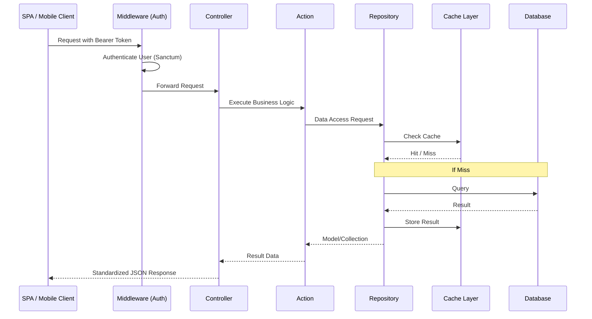

# Arsitektur Proyek

Proyek ini menggunakan arsitektur modular yang dirancang untuk mendukung aplikasi web (SPA) dan aplikasi mobile.

## Aliran Data Request

Berikut adalah diagram alir bagaimana sebuah request diproses di dalam sistem ini:

## Komunikasi Antar Modul

Setiap modul bersifat mandiri (*self-contained*), namun dapat berinteraksi satu sama lain melalui:
1. **Service Providers:** Untuk mendaftarkan fitur, migrasi, dan rute.
2. **Common Models:** Modul seperti `User` sering dirujuk oleh modul lain.
3. **Feature Flags:** Menggunakan Laravel Pennant untuk kontrol fitur yang dinamis antar user.

## Standar Kode

- **Strict Typing:** Semua file wajib menggunakan `declare(strict_types=1);`.
- **Logic Placement:** Controller hanya bertugas menerima input dan mengembalikan respon. Logika bisnis wajib diletakkan di kelas **Action**.
- **Data Access:** Semua interaksi database wajib melalui **Repository**.
- **Caching Layer:** Repository menggunakan trait `HasCache` untuk menangani caching transparan dengan strategi rotasi versi.
- **Background Jobs:** Proses yang memakan waktu lama (seperti pengiriman email) diproses secara asinkron menggunakan Laravel Queues.
