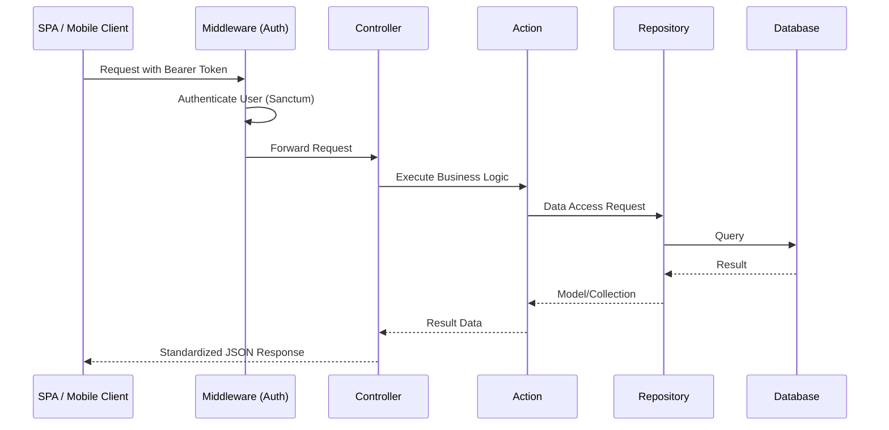

# Project Architecture

The project follows a modular architecture designed to support web applications (SPA) and mobile apps.

## Request Data Flow

The following diagram illustrates how a request is processed in the system:

## Modular Structure

Each module is self-contained and organized into specific layers.

### 1. Required Components
These components are essential for a module to function:
- **Models:** Eloquent model representing the database table.
- **Controllers:** Entry point for HTTP requests.
- **Providers:** Registers the module's services, migrations, and routes.
- **Routes:** Defines the API endpoints (typically in `Routes/v1.php`).

### 2. Optional Components (Recommended for Scalability)
These components can be skipped for simple modules but are recommended for enterprise-level logic:
- **Actions (Optional):** Encapsulates single business logic operations. Highly recommended to keep Controllers thin.
- **Repositories (Optional):** Abstracts data access logic. Useful for reuse and easier testing.
- **DTOs (Optional):** Ensures strict typing when passing data between Controller, Action, and Repository.
- **Filters (Optional):** Standardizes search, sorting, and filtering logic via query parameters.
- **Resources:** Standardizes the JSON output format.

## Inter-Module Communication

Modules should remain decoupled as much as possible:
1. **Service Providers:** To register features, migrations, and routes.
2. **Common Models:** Core modules like `User` are often referenced by others.
3. **Feature Flags:** Uses Laravel Pennant for dynamic feature control.

## Code Standards Summary

- **Strict Typing:** All files must use `declare(strict_types=1);`.
- **Logic Placement:** Controllers handle requests/responses; **Actions** handle business logic.
- **Data Access:** Interactions with the database should go through **Repositories**.
- **Background Jobs:** Long-running processes are handled asynchronously using Laravel Queues.
