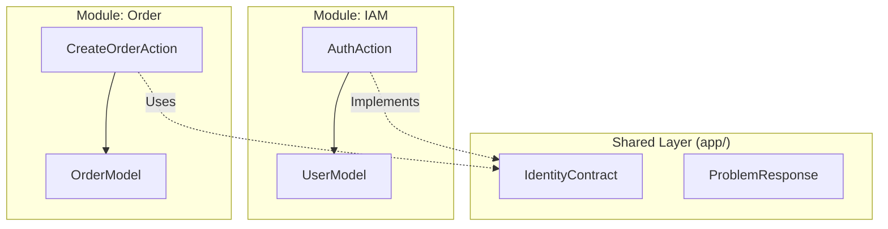

# Architecture Handbook: Modular Monolith

This project is built as a **Modular Monolith**. It gives you the speed of a monolith with the organization of microservices.

## The Story: Adding a New Feature

Imagine you want to add a **Marketing** module with a "Discount" feature.

### 1. Structure
Create the folder at `modules/Marketing/`.
```
Marketing/
├── Actions/        # Single Task (e.g., CalculateDiscountAction.php)
├── Controllers/    # HTTP layer
├── Models/         # Data layer
└── Routes/         # API endpoints
```

### 2. Communication
If the **Order** module needs to check a discount:
- **WRONG:** `use Modules\Marketing\Models\Discount;` (Tight coupling)
- **RIGHT:**
  1. Create `app/Contracts/MarketingContract.php`.
  2. Bind it in `MarketingServiceProvider.php`.
  3. Call `$marketing->calculate($order);` in the Order module.

## Module Isolation Diagram



## Key Rules
1. **Never** import a model from another module.
2. **Always** use Actions for business logic.
3. **Always** use Payloads (DTO) to pass data into Actions.
4. **Final** everything. No unintended inheritance.
