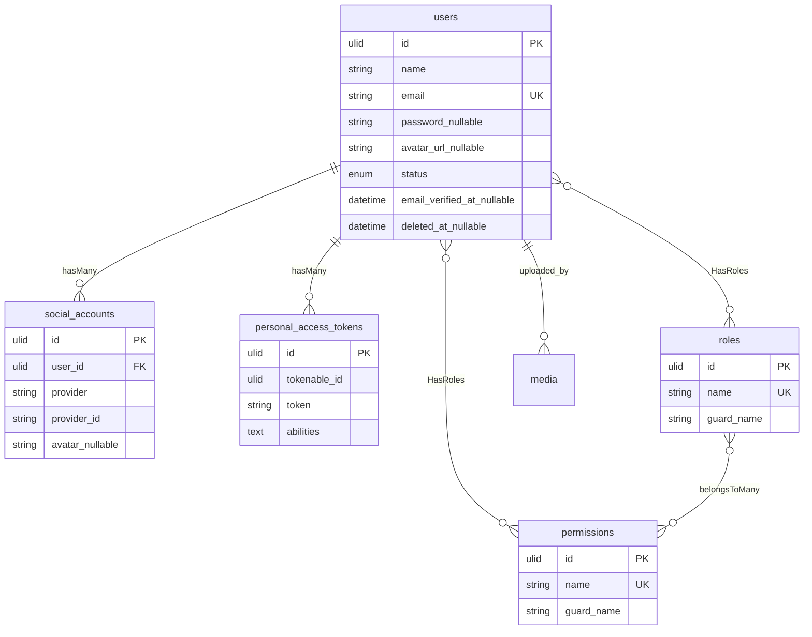
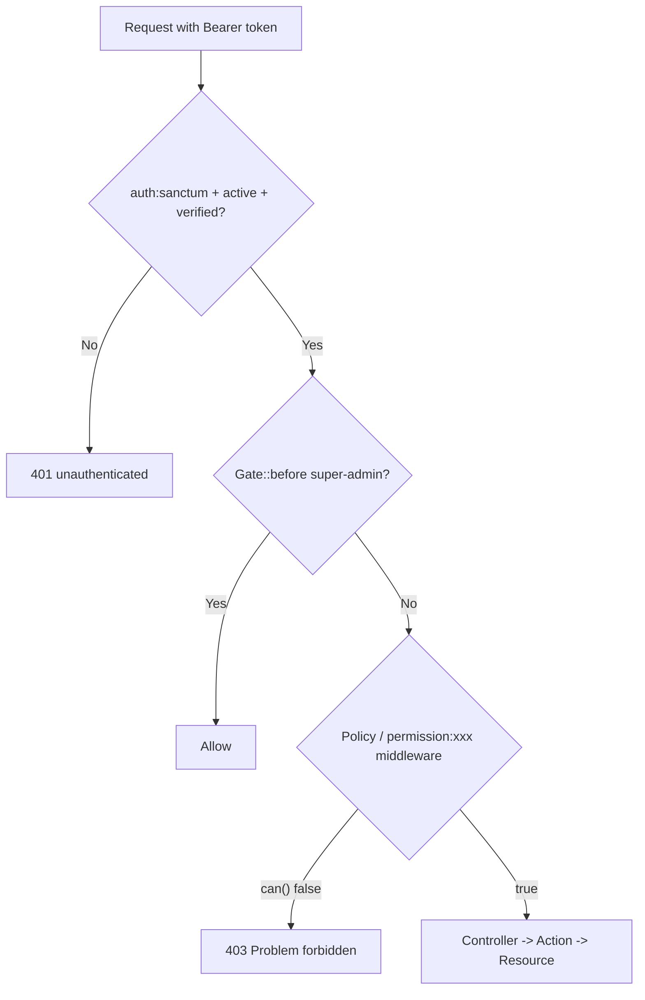

# IAM Module — Identity & Access Management

> Core module for authentication, authorization (RBAC), user profiles, device/session management, and social login. Enabled by default (`modules_statuses.json: {"IAM": true}`); required by `Media` (`module.json: requires ["IAM"]`).

## Setup

### Enable / Disable

```bash
# Enable (default)
php artisan module:enable IAM
# Disable (disables all IAM routes, policies, and social auth)
php artisan module:disable IAM
# Status
php artisan module:list
```

Activation is managed by `nwidart/laravel-modules` FileActivator (`modules_statuses.json`). A disabled module is silently ignored (config, migrations, routes skipped).

### Migrate & Seed

```bash
php artisan module:migrate IAM
php artisan db:seed --class="Modules\IAM\Database\Seeders\IAMSeeder"
# Or full seed (creates default roles, permissions, and test users)
php artisan db:seed
# Password for seeded users from config('auth.default_password') or random 32 chars
```

Seeded roles: `super-admin` (Gate::before bypass), `admin` (full CRUD), `user` (limited read). Permissions from `PermissionEnum` + `Media` permissions via `IAMSeeder`.

### Configuration

| Key | Default | Env | Description |
|-----|---------|-----|-------------|
| `iam.features.self-registration` | `true` | - | Allow `POST /auth/register` (feature-flag `iam.self-registration`) |
| `auth.verification.expire` | `60` | - | Signed email-verify URL lifetime (minutes) |
| `auth.default_password` | `null` | `AUTH_DEFAULT_PASSWORD` | Password for `php artisan db:seed` users; if empty, random |
| `socialite` (Google/GitHub) | - | `GOOGLE_CLIENT_ID`, `GOOGLE_CLIENT_SECRET`, `GITHUB_CLIENT_ID`, `GITHUB_CLIENT_SECRET`, `*_REDIRECT_URI` | OAuth creds per provider |

### Social Auth Setup

**Google:** https://console.cloud.google.com/apis/credentials → OAuth 2.0 Client ID → Authorized redirect `http://localhost:8000/api/v1/auth/social/google/callback`
**GitHub:** https://github.com/settings/developers → OAuth Apps → Callback `http://localhost:8000/api/v1/auth/social/github/callback`

Add to `.env`:
```env
GOOGLE_CLIENT_ID=xxx
GOOGLE_CLIENT_SECRET=yyy
GOOGLE_REDIRECT_URI=http://localhost:8000/api/v1/auth/social/google/callback
GITHUB_CLIENT_ID=xxx
GITHUB_CLIENT_SECRET=yyy
GITHUB_REDIRECT_URI=http://localhost:8000/api/v1/auth/social/github/callback
```

## Architecture

### ERD



### Flowchart — Authentication

```mermaid
flowchart TD
    A[POST /auth/register] --> B{self-registration enabled?}
    B -- No --> B1[403 Problem]
    B -- Yes --> C[Validate + Create User status=pending]
    C --> D[Send VerifyEmail signed URL via APP_FRONTEND_URL]
    E[GET /auth/email/verify/{id}/{hash}?signature=&expires] --> F{Valid signed URL?}
    F -- No --> F1[403]
    F -- Yes --> G[Mark email_verified_at, UserObserver -> status=Active]

    H[POST /auth/login] --> H1[Validate credentials]
    H1 --> H2[LoginAction -> Sanctum token abilities='*']
    H2 --> H3[Return Bearer token]

    I[POST /auth/forgot-password] --> I1[Send ResetPassword link via APP_FRONTEND_URL]
    J[POST /auth/reset-password + token] --> J1[Reset password]

    S1[GET /auth/social/{provider}/redirect] --> S2[SocialRedirectAction -> Socialite URL]
    S2 --> S3[Browser -> Provider OAuth]
    S3 --> S4[GET /auth/social/{provider}/callback]
    S4 --> S5[SocialCallbackAction: match provider+id -> email -> create user password=null -> Sanctum token]
```

### Flowchart — RBAC



### Schema — Layer Map

```mermaid
classDiagram
    class User {
        +HasRoles
        +HasApiTokens
        +socialAccounts() HasMany
        +hasPassword() bool
    }
    class UpdateProfilePayload {
        +string avatarMediaId
        +fromRequest() Payload
    }
    class UpdateProfileAction {
        +handle(Payload, User) User
        -resolveAvatarUrl() via MediaUrlResolver
    }
    class UserResource {
        +toArray() {avatar, status, roles}
    }
    class UserPolicy {
        +view/delete()
    }
    class UserBuilder {
        +allowedFilters: name,email,status
    }
    User --> UpdateProfilePayload
    UpdateProfilePayload --> UpdateProfileAction
    UpdateProfileAction --> User
    User --> UserResource
    User --> UserPolicy
```

## Endpoints

Base URL: `http://localhost:8000` — all routes prefixed `api/v1` via `RouteServiceProvider` (`api.v1.iam.*`).

### Auth (`/api/v1/auth`)

| Method | Path | Name | Middleware | Description |
|--------|------|------|------------|-------------|
| POST | `/auth/login` | `api.v1.iam.auth.login` | `throttle:auth` | Login, returns Bearer token |
| POST | `/auth/register` | `api.v1.iam.auth.register` | `feature-flag:iam.self-registration`, `throttle:auth`, `idempotency` | Register new user |
| POST | `/auth/forgot-password` | `api.v1.iam.auth.password.forgot` | `throttle:auth` | Send reset link |
| POST | `/auth/reset-password` | `api.v1.iam.auth.password.reset` | `throttle:auth` | Reset with token |
| GET | `/auth/email/verify/{id}/{hash}` | `api.v1.iam.auth.verification.verify` | `auth:sanctum`, `signed`, `throttle:api` | Verify email (signed URL) |
| POST | `/auth/email/verification-notification` | `api.v1.iam.auth.verification.send` | `auth:sanctum`, `active`, `ability:users:write` | Re-send verification |
| POST | `/auth/change-password` | `api.v1.iam.auth.password.change` | `auth:sanctum`, `active` | Change password |
| POST | `/auth/logout` | `api.v1.iam.auth.logout` | `auth:sanctum`, `active`, `ability:auth:manage` | Revoke current token |
| DELETE | `/auth/account` | `api.v1.iam.auth.account.delete` | `auth:sanctum`, `active` | Delete own account |
| GET | `/auth/me` | `api.v1.iam.auth.me` | `auth:sanctum`, `active`, `ability:users:read` | Get authenticated user |
| PUT | `/auth/me` | `api.v1.iam.auth.me.update` | `auth:sanctum`, `active`, `verified` | Update profile (name, email, avatar) |
| GET | `/auth/social/{provider}/redirect` | `api.v1.iam.auth.social.redirect` | `throttle:api` | Get OAuth provider URL |
| GET | `/auth/social/{provider}/callback` | `api.v1.iam.auth.social.callback` | `throttle:api` | Handle OAuth callback |
| GET | `/auth/social/{provider}/link` | `api.v1.iam.auth.social.link` | `auth:sanctum`, `active`, `verified` | Link provider to current user |
| DELETE | `/auth/social/{provider}` | `api.v1.iam.auth.social.unlink` | `auth:sanctum`, `active`, `verified` | Unlink provider |
| GET | `/auth/devices` | `api.v1.iam.auth.devices.index` | `auth:sanctum`, `active`, `verified`, `ability:auth:manage` | List active tokens/devices |
| DELETE | `/auth/devices/{device}` | `api.v1.iam.auth.devices.delete` | `auth:sanctum`, `active`, `verified`, `ability:auth:manage` | Revoke device token |
| POST | `/auth/devices/logout-others` | `api.v1.iam.auth.devices.logout-others` | `auth:sanctum`, `active`, `verified`, `ability:auth:manage` | Revoke other tokens |

### Users (`/api/v1/users`) — `auth:sanctum`, `active`, `verified`, `throttle:api` + ULID constraint

| Method | Path | Name | Permission | Description |
|--------|------|------|------------|-------------|
| GET | `/users` | `api.v1.iam.user.index` | `user.view` | List paginated, filterable |
| POST | `/users` | `api.v1.iam.user.create` | `user.create` | Create user |
| POST | `/users/bulk/delete` | `api.v1.iam.user.bulk.delete` | `user.delete` | Bulk soft delete |
| POST | `/users/bulk/restore` | `api.v1.iam.user.bulk.restore` | `user.restore` | Bulk restore |
| GET | `/users/{user}` | `api.v1.iam.user.show` | - | Show (owner or policy) |
| PUT | `/users/{user}` | `api.v1.iam.user.update` | - | Update |
| PUT | `/users/{user}/roles` | `api.v1.iam.user.roles.assign` | `user.edit` | Assign roles |
| DELETE | `/users/{user}` | `api.v1.iam.user.delete` | `user.delete` | Soft delete |

### Roles (`/api/v1/roles`)

| Method | Path | Name | Permission |
|--------|------|------|------------|
| GET | `/roles` | `api.v1.iam.role.index` | `role.view` |
| POST | `/roles` | `api.v1.iam.role.create` | `role.create` |
| POST | `/roles/bulk/delete` | `api.v1.iam.role.bulk.delete` | `role.delete` |
| GET | `/roles/{role}` | `api.v1.iam.role.show` | `role.view` |
| PUT | `/roles/{role}` | `api.v1.iam.role.update` | `role.edit` |
| DELETE | `/roles/{role}` | `api.v1.iam.role.delete` | `role.delete` |

### Permissions (`/api/v1/permissions`)

| Method | Path | Name | Permission |
|--------|------|------|------------|
| GET | `/permissions` | `api.v1.iam.permission.index` | `permission.view` |
| POST | `/permissions` | `api.v1.iam.permission.create` | `permission.create` |
| GET | `/permissions/{permission}` | `api.v1.iam.permission.show` | `permission.view` |
| PUT | `/permissions/{permission}` | `api.v1.iam.permission.update` | `permission.edit` |
| DELETE | `/permissions/{permission}` | `api.v1.iam.permission.delete` | `permission.delete` |

Envelope: `SuccessResponse {status,title,detail,data,meta}` / `ProblemResponse` RFC 9457 — see `docs/api-standard.md`.

## cURL Examples

```bash
# Register (if self-registration enabled)
curl -X POST http://localhost:8000/api/v1/auth/register \
  -H "Content-Type: application/json" \
  -H "Accept: application/json" \
  -d '{"name":"Alice","email":"alice@example.com","password":"Secret123!@#","password_confirmation":"Secret123!@#"}'

# Login
curl -X POST http://localhost:8000/api/v1/auth/login \
  -H "Content-Type: application/json" \
  -d '{"email":"alice@example.com","password":"Secret123!@#"}'
# => {"status":200,"data":{"access_token":"1|...","token_type":"Bearer"}}

TOKEN="1|..."

# Me
curl http://localhost:8000/api/v1/auth/me \
  -H "Authorization: Bearer $TOKEN" -H "Accept: application/json"

# Update profile (change name + avatar via Media ID)
curl -X PUT http://localhost:8000/api/v1/auth/me \
  -H "Authorization: Bearer $TOKEN" -H "Content-Type: application/json" \
  -d '{"name":"Alice Updated","avatar":"01H...ULID..."}'

# List users (paginated, filterable via UserBuilder)
curl "http://localhost:8000/api/v1/users?filter[name]=Alice&sort=-created_at" \
  -H "Authorization: Bearer $TOKEN"

# Create role with permissions
curl -X POST http://localhost:8000/api/v1/roles \
  -H "Authorization: Bearer $TOKEN" -H "Content-Type: application/json" \
  -d '{"name":"editor","permissions":["user.view","user.edit"]}'

# Social redirect (browser or API)
curl http://localhost:8000/api/v1/auth/social/google/redirect \
  -H "Accept: application/json"
# => {"data":{"url":"https://accounts.google.com/o/oauth2/auth?..."}}

# Devices
curl http://localhost:8000/api/v1/auth/devices -H "Authorization: Bearer $TOKEN"
curl -X DELETE http://localhost:8000/api/v1/auth/devices/1 -H "Authorization: Bearer $TOKEN"

# Logout
curl -X POST http://localhost:8000/api/v1/auth/logout -H "Authorization: Bearer $TOKEN"
```

## Customize

- **Permissions/Roles:** Add new values to `App\Enums\PermissionEnum` / `RoleEnum`, run `php artisan db:seed` (creates via `IAMSeeder`). Assign via `UserAssignRolesController` or Spatie `givePermissionTo()`.
- **Policies:** `Modules\IAM\Policies\UserPolicy` registered via `#[UsePolicy]` on `User` model. Add abilities with `Gate` or `#[UsePolicy]`.
- **Feature flag:** `iam.features.self-registration` in `modules/IAM/config/config.php` — toggle via `config/iam.php` or `Pennant::define()` + middleware `feature-flag:iam.self-registration`.
- **Observer:** `Modules\IAM\Observers\UserObserver` (`#[ObservedBy]`) auto-activates user on `email_verified_at` set (`UserStatusEnum::Active`).
- **Add endpoint:** Create `app/Http/Controllers/V1/{Action}Controller` (invokable `final readonly`), `app/Actions/{Action}`, `app/Http/Requests/V1/{Action}Request`, `app/Http/Resources`, register route in `routes/V1.php` under `api/v1` prefix.

## Testing

```bash
# All IAM tests
php artisan test --filter="IAM"
# Or by group (if configured)
php artisan test --group=module:iam
# Helpers: loginAsUser(), Storage::fake, Sanctum::actingAs
```

Coverage: Feature tests per endpoint + Unit for `UserBuilder`, `SocialAccount`, actions. See `modules/IAM/tests/`.

## Related Docs

- [API Standard](../../docs/api-standard.md) — envelope shapes
- [Architecture](../../docs/architecture.md) — module anatomy & layer map
- [Rate Limiting](../../docs/rate-limiting.md) — global tiers (`auth`/`api`/`authenticated`); IAM uses `throttle:auth` on login/register
- ADRs: [0004 Identity Contract](../../docs/adr/0004-identity-contract.md), [0006 Gate Policy](../../docs/adr/0006-module-policies-gate-policy.md), [0021 Social Auth](../../docs/adr/0021-social-auth-design.md), [0029 nwidart Modules](../../docs/adr/0029-nwidart-laravel-modules.md)
- Scramble OpenAPI: `http://localhost:8000/docs/api` (auto from routes, `config/scramble.php:23` `api_path='api'`)
