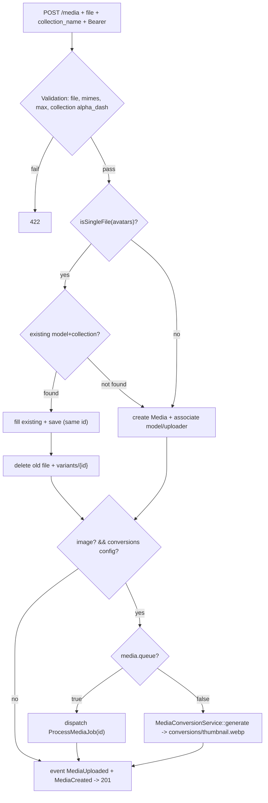
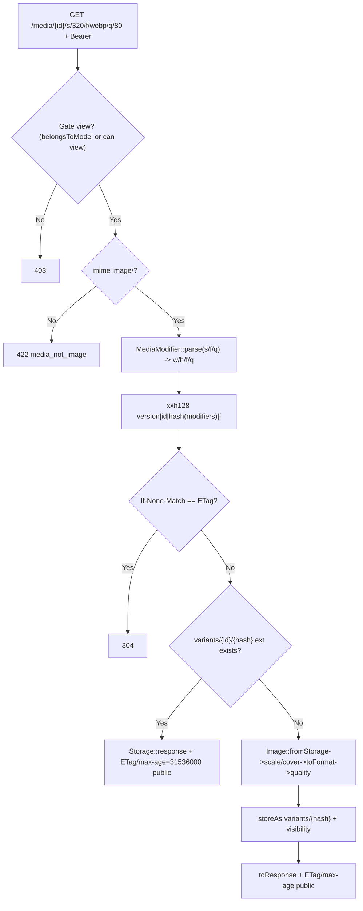
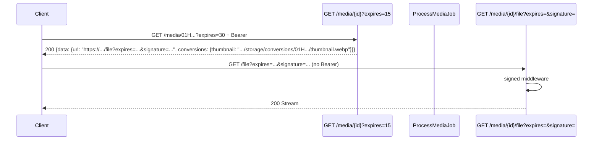
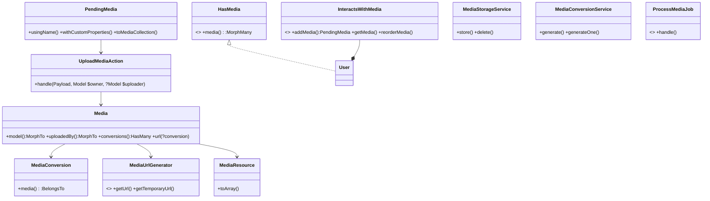

# Media Module — Polymorphic Media Library (Spatie-inspired)

> Lightweight custom module inspired by Spatie Media Library. Polymorphic `model_type/model_id` + `uploaded_by` morph, `order_column`, `sha256`, `custom_properties`, image conversions (`thumbnail`/`medium`/`large`) via `MediaConversionService` + `ProcessMediaJob` (queue/sync), `InteractsWithMedia` trait + `PendingMedia` fluent, single_file `avatars`, signed streaming. **Media is independent** (`requires []`), `IAM` `requires ["Media"]` (`User implements HasMedia`).

## Setup

### Enable / Disable

```bash
php artisan module:enable Media
php artisan module:disable Media
php artisan module:list
```

`IAM` now depends on `Media` (User trait). Enable `Media` first, then `IAM`.

### Migrate & Seed

```bash
php artisan migrate:fresh
# or
php artisan module:migrate Media
php artisan db:seed --class="Modules\IAM\Database\Seeders\IAMSeeder"
```

### Configuration

| Key | Default | Description |
|-----|---------|-------------|
| `media.disk` | `public` | Filesystem disk (`config/filesystems.php`). `public` uses `storage/app/public` + `url` `/storage`. `php artisan storage:link`. |
| `media.max_size` | `2048` | Max upload KB |
| `media.mimes` | `['jpg','jpeg','png','webp','gif','bmp']` | Allowed extensions (validated via `mimes:`) |
| `media.collections` | `default/avatars/documents` | Per-collection `visibility` + `single_file` (avatars `public` + `single_file:true`) |
| `media.queue` | `false` | `env('MEDIA_QUEUE', false)` — true = dispatch `ProcessMediaJob` |
| `media.conversions` | `thumbnail/medium/large` | Named conversions `{width,height,fit,format,quality}` |
| `images.default` | `env('IMAGE_DRIVER','gd')` | `config/images.php` driver `gd`/`imagick` |

Env for S3 + queue:
```env
MEDIA_DISK=s3
MEDIA_QUEUE=true
IMAGE_DRIVER=imagick
```

Collections/conversions live in `modules/Media/config/config.php` (merged as `config('media.*')`).

## Architecture

### ERD

```mermaid
erDiagram
    media ||--o{ media_conversions : hasMany
    media {
        ulid id PK
        string model_type "nullable, morph"
        ulid model_id "nullable"
        string collection_name
        string disk
        string mime_type
        int size
        string path UK
        enum visibility
        string original_name "nullable"
        string original_extension "nullable"
        string sha256 "nullable, indexed"
        json meta "nullable"
        json custom_properties "nullable"
        int order_column
        string uploaded_by_type "nullable, morph"
        ulid uploaded_by_id "nullable"
        datetime created_at
        datetime updated_at
    }
    media_conversions {
        ulid id PK
        ulid media_id FK "cascade"
        string name "thumbnail/medium/large"
        string disk
        string path
        string mime_type
        int size "nullable"
        string etag "nullable"
        datetime created_at
        datetime updated_at
    }
    users ||--o{ media : "morphMany via model"
    media_conversions ||--o{ media : belongsTo
}
```

### Trait — Spatie-like

```php
use Modules\Media\Traits\InteractsWithMedia;
use Modules\Media\Contracts\HasMedia;

class User extends Authenticatable implements HasMedia {
    use InteractsWithMedia;

    public function registerMediaCollections(): void {
        $this->addMediaCollection('avatars')->singleFile()->acceptsMimeTypes(['image/jpeg','image/png'])->useFallbackUrl('/images/avatar-fallback.webp');
        $this->addMediaCollection('documents');
    }
    public function registerMediaConversions(?Media $media = null): void {
        $this->addMediaConversion('thumbnail')->width(320)->height(320)->fit('cover')->format('webp')->quality(80)->performOnCollections('avatars');
        $this->addMediaConversion('medium')->width(1024)->format('webp')->quality(85)->performOnCollections(['avatars','default']);
    }
}

// Classic
$user->addMedia($file)->usingName('cover')->withCustomProperties(['alt'=>'...'])->toMediaCollection('avatars');
$user->addMediaFromRequest('avatar')->toMediaCollection('avatars');
$user->addMediaFromUrl('https://example.com/image.jpg')->toMediaCollection('gallery');
$user->addMediaFromString('hello', 'hello.txt')->toMediaCollection('documents');
$user->addMedia($file)->usingFileName('custom.jpg')->sanitizingFileName(fn($n)=>Str::slug($n))->preservingOriginal()->withManipulations(['filter'=>'grayscale'])->toMediaCollection('gallery');

// Query
$user->getMedia('avatars'); // ordered
$user->hasMedia('avatars'); // bool
$user->getFirstMedia('avatars');
$user->getFirstMediaUrl('avatars'); // or getFirstMediaUrl('avatars','thumbnail')
$user->getFirstMediaUrl('avatars','thumbnail'); // conversion
$user->getFallbackMediaUrl('avatars'); // fallbackUrl if no media
$user->reorderMedia('gallery', [$id3, $id1, $id2]);
$user->clearMediaCollection('avatars');
$user->clearMediaCollectionExcept('gallery', [$keepId]);

// Model helpers
$media->url('thumbnail'); $media->getFullUrl('thumbnail'); $media->getPath('thumbnail');
$media->getTemporaryUrl(now()->addMinutes(15), 'thumbnail');
$media->hasGeneratedConversion('thumbnail'); $media->getConversion('thumbnail');
$media->getCustomProperty('alt'); $media->setCustomProperty('alt','x'); $media->hasCustomProperty('alt');
```

### Flowchart — Upload (polymorphic + single_file + conversions)



### Flowchart — Modifier (resized, on-the-fly via MediaModifier)



### Flowchart — Signed Streaming + Conversions



### Layer Map



## Endpoints

Base `http://localhost:8000` — `api/v1/media` via `RouteServiceProvider` (`api.v1.media.*`). ULID constraint.

| Method | Path | Name | Middleware | Description |
|--------|------|------|------------|-------------|
| POST | `/media` | `api.v1.media.upload` | `auth:sanctum`, `active`, `throttle:api`, `permission:media.create` | Upload file (multipart `file` + `collection_name` default `default`). Avatars `single_file` upsert (same id). |
| GET | `/media` | `api.v1.media.index` | `auth:sanctum`, `active`, `throttle:api`, `permission:media.view` | List paginated, filtered to `model_type/model_id` of current user, `MediaBuilder` |
| GET | `/media/{media}` | `api.v1.media.show` | `auth:sanctum`, `active`, `throttle:api` | Show one; `?expires=1..1440` swaps `url` for signed link, includes `conversions` map |
| GET | `/media/{media}/s/{modifiers}` | `api.v1.media.modifier` | `auth:sanctum`, `active`, `throttle:api` | On-the-fly modifier `s/320`, `s/320x200`, `s/320/f/webp/q/80`, `w/400/h/300/f/jpg` via `MediaModifier` (`w 32..2000`, `f webp/jpg`, `q 1..100`), `ETag` + `max-age=31536000` |
| GET | `/media/{media}/file` | `api.v1.media.file` | `signed`, `throttle:api` | **Public** signed streaming, no Bearer |
| DELETE | `/media/{media}` | `api.v1.media.delete` | `auth:sanctum`, `active`, `throttle:api` | Delete (owner/uploader or `media.delete`), removes file + `variants/{id}` + `conversions/{id}` + `media_conversions` rows |

## cURL Examples

```bash
TOKEN="1|..."

# Upload avatar (public, single_file — second upload reuses same id)
curl -X POST http://localhost:8000/api/v1/media \
  -H "Authorization: Bearer $TOKEN" \
  -F "file=@photo.jpg" -F "collection_name=avatars"
# => 201 {"data":{"media":{"id":"01H...","model_type":"Modules\\IAM\\Models\\User","model_id":"01H...","collection_name":"avatars","mime_type":"image/webp","visibility":"public","url":"http://.../storage/avatars/...webp","conversions":{"thumbnail":"http://.../storage/conversions/01H.../thumbnail.webp"}},"url":"..."}}

# Trait (in code)
# $user->addMedia($file)->toMediaCollection('avatars');
# $user->reorderMedia('gallery', [$id3,$id1,$id2]);

# Private document (url null, use signed)
curl -X POST http://localhost:8000/api/v1/media -H "Authorization: Bearer $TOKEN" -F "file=@doc.pdf"
curl http://localhost:8000/api/v1/media/01H... -H "Authorization: Bearer $TOKEN" # url null
curl "http://localhost:8000/api/v1/media/01H...?expires=30" -H "Authorization: Bearer $TOKEN" # signed url

# Modifier (on-the-fly)
curl "http://localhost:8000/api/v1/media/01H.../s/320" -H "Authorization: Bearer $TOKEN" --output thumb.webp
curl "http://localhost:8000/api/v1/media/01H.../s/320/f/webp/q/80" -H "Authorization: Bearer $TOKEN" --output thumb2.webp
curl "http://localhost:8000/api/v1/media/01H.../s/320x200" -H "Authorization: Bearer $TOKEN" --output thumb3.webp

# Signed file
SIGNED="http://localhost:8000/api/v1/media/01H.../file?expires=...&signature=..."
curl "$SIGNED" --output private.pdf

# Reprocess conversions (sync or queued)
php artisan media:reprocess --collection=avatars
php artisan media:reprocess --id=01H... --queued

# Cleanup orphans
php artisan media:cleanup --dry-run
php artisan media:cleanup
```

## Artisan

```bash
php artisan media:cleanup --dry-run # list orphan files vs DB
php artisan media:reprocess --collection=avatars --queued # dispatch jobs
php artisan media:reprocess --id=01H... # sync
```

## Customize

- **Collections/conversions:** `modules/Media/config/config.php` `collections` + `conversions` + `queue` (env `MEDIA_QUEUE`).
- **Image pipeline:** `UploadMediaAction::storeProcessedImage` `orient()->optimize()` or `cover()`.
- **Trait:** `InteractsWithMedia` `media()` + `getMedia`/`reorderMedia`/`clearMediaCollection`.
- **Events:** `MediaCreated`/`MediaUploaded`/`MediaProcessed`/`MediaProcessingFailed`/`MediaDeleted` in `app/Events`.
- **Policy:** `MediaPolicy` `view/delete` via `#[UsePolicy]` — `isPublic` or `belongsToModel` or `is(uploadedBy)` or `can`.

## Testing

```bash
# All Media tests (72 tests)
php artisan test --filter="Media"
# Helpers: Storage::fake('public'), UploadedFile::fake()->image(), MediaFactory::new()->forModel($user), DB::table('permissions')->insertOrIgnore
# Trait: InteractsWithMediaTest (addMedia, getMedia, reorder), MediaConversionTest (sync conversions), MediaModifierTest (s/320, s/320x200, cache, 304), MediaCollectionOpsTest (hasMedia, clearExcept, getFirstMediaUrl+conversion), MediaFromHelpersTest (fromRequest/Url/String, usingFileName, preservingOriginal)
```

Coverage: `MediaUploadTest` (WebP, single_file avatars upsert), `MediaConversionTest` (thumbnail), `InteractsWithMediaTest`, `MediaModifierTest`, `MediaCollectionOpsTest`, `MediaFromHelpersTest`, `MediaFileTest`, `MediaShowTest`, `MediaListTest`, `MediaDeleteTest`, `MediaAvatarFlowTest`.

## Related Docs

- [API Standard](../../docs/api-standard.md)
- [Architecture](../../docs/architecture.md)
- [Rate Limiting](../../docs/rate-limiting.md)
- ADRs: [0015 Media Storage](../../docs/adr/0015-media-storage-module.md), [0030 Custom Media](../../docs/adr/0030-custom-media-module.md), [0031 Image Processing](../../docs/adr/0031-first-party-image-processing.md), [0032 Signed+Events+Cache](../../docs/adr/0032-signed-media-events-cached-variants.md), [0036 Media Polymorphic Squash](../../docs/adr/0036-media-polymorphic-squash.md)
- Scramble OpenAPI: `http://localhost:8000/docs/api`
