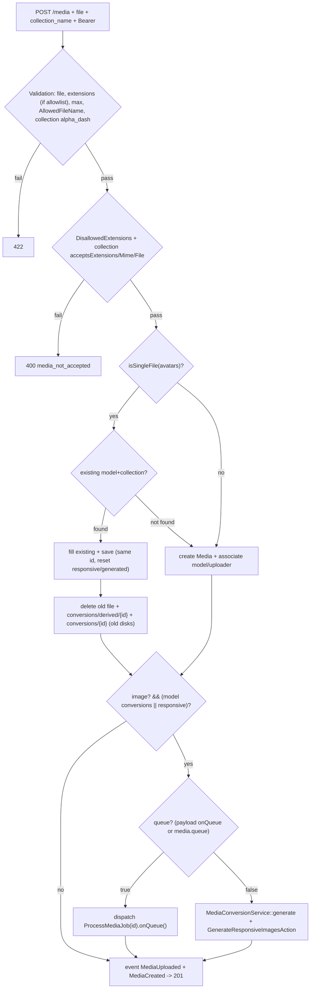
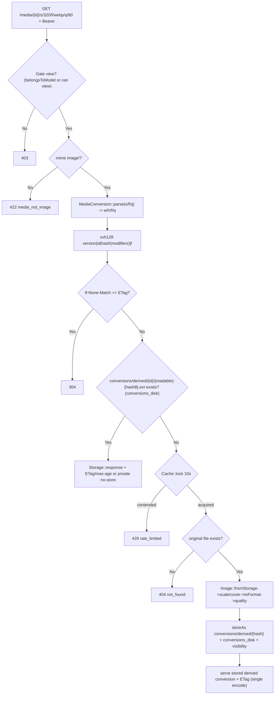
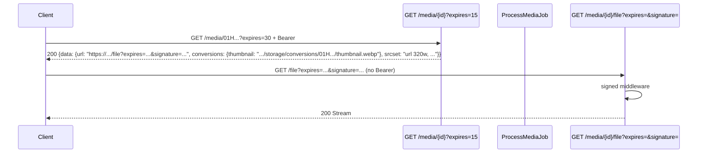

# Media Module — Polymorphic Media Library (Spatie-inspired)

> Lightweight custom module inspired by Spatie Media Library. Polymorphic `model_type/model_id` + `uploaded_by` morph, `order_column`, `sha256`, `custom_properties`, image conversions (`thumbnail`/`medium`/`large` via `MediaConversionService` + `ProcessMediaJob` (queue/sync)), `InteractsWithMedia` trait + `FileAdder` fluent, single_file `avatars`, responsive `srcset`, signed streaming. **Media is independent** (`requires []`), `IAM` `requires ["Media"]` (`User implements HasMedia`).

## Setup

### Enable / Disable

```bash
php artisan module:enable Media
php artisan module:disable Media
php artisan module:list
```

`IAM` now depends on `Media` (User trait). Enable `Media` first, then `IAM`.

### Migrate & Seed

```bash
php artisan migrate:fresh
# or
php artisan module:migrate Media
php artisan db:seed --class="Modules\IAM\Database\Seeders\IAMSeeder"
```

### Configuration

| Key | Default | Description |
|-----|---------|-------------|
| `media.disk` | `public` | Filesystem disk for public media. `php artisan storage:link`. |
| `media.private_disk` | `local` | Disk for private collections (non-public visibility routes here). |
| `media.max_size` | `2048` | Max upload KB (also used for downloader size cap `max_size * 1024`) |
| `media.allowed_extensions` | `null` | Global extension allowlist (`null` = disabled, defer to disallowed + collection rules). |
| `media.disallowed_extensions` | `DisallowedExtensions::$default` | Executable/script extensions blocked on every dot segment |
| `media.file_namer` | `DefaultFileNamer` | Strategy for original/conversion/responsive names (`conversionFileName` = `{name}-{conversion}.{ext}`) |
| `media.path_generator` | `DefaultPathGenerator` | Strategy for `getPath()` (`collection/file_name` + prefix) |
| `media.custom_path_generators` | `[]` | Per-model overrides keyed by `model_type` |
| `media.url_generator` | `DefaultUrlGenerator` | Strategy for `url()` / `temporaryUrl()` |
| `media.version_urls` | `false` | Append `?v=updated_at` cache-busting to public URLs |
| `media.temporary_url_default_lifetime` | `10` | Default minutes for `signedUrl(null)` |
| `media.prefix` | `''` | Prepended to every stored path via `App\Support\Media\MediaPrefix` |
| `media.conversions_disk_name` | `null` | Disk for conversions (null = same as original) |
| `media.remote.extra_headers` | `[]` | Headers merged into every storage write (S3 `CacheControl` etc.) |
| `media.media_downloader` | `DefaultDownloader` | Class for `addMediaFromUrl` fetching |
| `media.media_downloader_ssl` | `true` | Verify SSL on download |
| `media.downloader_timeout` | `10` | Timeout seconds for downloader |
| `media.downloader_allow_http` | `false` | Allow plain `http` URLs |
| `media.responsive.widths` | `[320,640,1024,1600]` | Target widths for responsive (capped, never upscale) |
| `media.file_remover` | `DefaultFileRemover` | Strategy for `removeAllFiles` |
| `media.queue` | `false` | `env('MEDIA_QUEUE', false)` — true = dispatch `ProcessMediaJob` |
| `images.default` | `env('IMAGE_DRIVER','gd')` | `config/images.php` driver `gd`/`imagick` |

Collections/conversions are **model-driven** (`registerMediaCollections` / `registerMediaConversions` on `HasMedia` models), not config. `queue` alone is config.

## Architecture

### ERD

```mermaid
erDiagram
    media ||--o{ media_conversions : hasMany
    media {
        ulid id PK
        string model_type "nullable, morph"
        ulid model_id "nullable"
        string collection_name "default default"
        string name
        string file_name
        string disk
        string conversions_disk "nullable"
        string mime_type
        unsignedBigInteger size
        string visibility "default private"
        string original_name "nullable"
        string original_extension "nullable, 20"
        string sha256 "nullable, indexed, 64"
        json manipulations "nullable"
        json custom_properties "nullable"
        json generated_conversions "nullable"
        json responsive_images "nullable"
        json meta "nullable (width,height,original_name)"
        unsignedInteger order_column "default 0"
        string uploaded_by_type "nullable, morph"
        ulid uploaded_by_id "nullable"
        datetime created_at
        datetime updated_at
    }
    media_conversions {
        ulid id PK
        ulid media_id FK "cascade"
        string name "thumbnail/medium/large"
        string disk
        string path
        string mime_type
        int size "nullable"
        string etag "nullable"
        datetime created_at
        datetime updated_at
    }
    users ||--o{ media : "morphMany via model"
    media_conversions ||--o{ media : belongsTo
}
```

### Trait — Spatie-like

```php
use Modules\Media\Traits\InteractsWithMedia;
use Modules\Media\Contracts\HasMedia;

class User extends Authenticatable implements HasMedia {
    use InteractsWithMedia;

    public function registerMediaCollections(): void {
        $this->addMediaCollection('avatars')->singleFile()->visibility('public')->acceptsMimeTypes(['image/jpeg','image/png'])->useFallbackUrl('/images/avatar-fallback.webp');
        $this->addMediaCollection('documents');
    }
    public function registerMediaConversions(?Media $media = null): void {
        $this->addMediaConversion('thumbnail')->width(320)->height(320)->fit('cover')->format('webp')->quality(80)->performOnCollections('avatars');
        $this->addMediaConversion('medium')->width(1024)->format('webp')->quality(85)->performOnCollections(['avatars','default']);
    }
}

// Classic — FileAdder fluent (Spatie FileAdder equivalent)
$user->addMedia($file)->usingName('cover')->withCustomProperties(['alt'=>'...'])->toMediaCollection('avatars');
$user->addMediaFromRequest('avatar')->toMediaCollection('avatars');
$user->addMediaFromUrl('https://example.com/image.jpg')->toMediaCollection('gallery');
$user->addMediaFromString('hello', 'hello.txt')->toMediaCollection('documents');
$user->addMedia($file)->usingFileName('custom.jpg')->sanitizingFileName(fn($n)=>Str::slug($n))->preservingOriginal()->withManipulations(['filter'=>'grayscale'])->toMediaCollection('gallery');
$user->addMedia($file)->withResponsiveImages()->storingConversionsOnDisk('s3')->setOrder(5)->onQueue('media')->addCustomHeaders(['CacheControl'=>'max-age=60'])->toMediaCollection('gallery');

// Query
$user->getMedia('avatars'); // ordered Collection
$user->hasMedia('avatars'); // bool
$user->getFirstMedia('avatars');
$user->getFirstMediaUrl('avatars'); // or getFirstMediaUrl('avatars','thumbnail')
$user->getFirstMediaPath('avatars','thumbnail');
$user->getFallbackMediaUrl('avatars'); // fallbackUrl if no media
$user->reorderMedia('gallery', [$id3, $id1, $id2]);
$user->clearMediaCollection('avatars');
$user->clearMediaCollectionExcept('gallery', [$keepId]);

// Model helpers
$media->url('thumbnail'); $media->getFullUrl('thumbnail'); $media->getPath('thumbnail'); // conversion path from DB
$media->getTemporaryUrl(now()->addMinutes(15), 'thumbnail');
$media->getSrcset(); // responsive srcset string or null
$media->hasGeneratedConversion('thumbnail'); $media->getConversion('thumbnail');
$media->getCustomProperty('alt'); $media->setCustomProperty('alt','x'); $media->hasCustomProperty('alt');
```

### Flowchart — Upload (polymorphic + single_file + conversions)



### Flowchart — Modifier (resized, on-the-fly via MediaConversion)



### Flowchart — Signed Streaming + Conversions



### Layer Map

```mermaid
classDiagram
    class HasMedia { <<interface>> +media():MorphMany +addMedia():FileAdder +getMedia() +getFirstMedia() +reorderMedia() }
    class InteractsWithMedia { <<trait>> +addMedia():FileAdder +getMedia() +reorderMedia() +getRegisteredMediaCollections() }
    class FileAdder { +usingName() +usingFileName() +withCustomProperties() +toMediaCollection() +withResponsiveImages() +storingConversionsOnDisk() +onQueue() }
    class Media { +model():MorphTo +uploadedBy():MorphTo +conversions():HasMany +url(?conversion) +getPath(?conversion) +getSrcset() }
    class MediaConversionModel { <<Eloquent>> +media():BelongsTo }
    class MediaConversionBuilder { <<value object>> +width() +fit() +performOnCollections() +fromModifiers() }
    class UploadMediaAction { +handle(Payload, Model $owner, ?Model $uploader) }
    class MediaUrlGenerator { <<interface>> +getUrl() +getTemporaryUrl() }
    class MediaStorageService { +store() +delete() }
    class MediaConversionService { +generate() +generateOne() +generateNamed() }
    class GenerateResponsiveImagesAction { +wantsResponsive() +handle() }
    class MediaFileRemover { <<interface>> +removeAllFiles() }
    class ProcessMediaJob { <<ShouldQueue>> +handle() }
    class MediaResource { +toArray() }
    HasMedia <|.. User
    InteractsWithMedia --* User
    FileAdder --> UploadMediaAction
    UploadMediaAction --> Media
    Media --> MediaConversionModel
    Media --> MediaUrlGenerator
    Media --> MediaResource
```



## Endpoints

Base `http://localhost:8000` — `api/v1/media` via `RouteServiceProvider` (`api.v1.media.*`). ULID constraint.

| Method | Path | Name | Middleware | Description |
|--------|------|------|------------|-------------|
| POST | `/media` | `api.v1.media.upload` | `auth:sanctum`, `active`, `throttle:api`, `permission:media.create` | Upload file (multipart `file` + `collection_name` default `default`). Avatars `singleFile` upsert (same id). Global `allowed_extensions` if set, plus `DisallowedExtensions` and collection `accepts*` guards (400). |
| GET | `/media` | `api.v1.media.index` | `auth:sanctum`, `active`, `throttle:api` | List paginated, filtered to `model_type/model_id` of current user, `MediaBuilder` |
| GET | `/media/{media}` | `api.v1.media.show` | `auth:sanctum`, `active`, `throttle:api` | Show one; `?expires=1..1440` swaps `url` for signed link, includes `conversions` map + `srcset` |
| GET | `/media/{media}/s/{modifiers}` | `api.v1.media.modifier` | `auth:sanctum`, `active`, `throttle:api` | On-the-fly modifier `s/320`, `s/320x200`, `s/320/f/webp/q/80`, `w/400/h/300/f/jpg` via `MediaConversion` (`w 32..2000`, `f webp/jpg`, `q 1..100`), `ETag` + `Cache::lock` |
| GET | `/media/{media}/file` | `api.v1.media.file` | `signed`, `throttle:api` | **Public** signed streaming, no Bearer |
| DELETE | `/media/{media}` | `api.v1.media.delete` | `auth:sanctum`, `active`, `throttle:api` | Delete (owner/uploader or `media.delete`), removes file + `conversions/derived/{id}` + `conversions/{id}` via `MediaFileRemover` + `media_conversions` rows |

## cURL Examples

```bash
TOKEN="1|..."

# Upload avatar (public, singleFile — second upload reuses same id, old file removed)
curl -X POST http://localhost:8000/api/v1/media \
  -H "Authorization: Bearer $TOKEN" \
  -F "file=@photo.jpg" -F "collection_name=avatars"
# => 201 {"data":{"media":{"id":"01H...","model_type":"Modules\\IAM\\Models\\User","model_id":"01H...","collection_name":"avatars","mime_type":"image/webp","visibility":"public","url":"http://.../storage/avatars/...webp","conversions":{"thumbnail":"http://.../storage/conversions/01H.../thumbnail.webp"},"srcset":"http://.../storage/avatars/responsive-images/320-...webp 320w, ..."}},"url":"..."}}

# Trait (in code)
# $user->addMedia($file)->toMediaCollection('avatars');
# $user->addMediaFromRequest('avatar')->toMediaCollection('avatars');
# $user->addAllMediaFromRequest()->each->toMediaCollection('gallery');
# $user->reorderMedia('gallery', [$id3,$id1,$id2]);

# Private document (url null, use signed)
curl -X POST http://localhost:8000/api/v1/media -H "Authorization: Bearer $TOKEN" -F "file=@doc.pdf"
curl http://localhost:8000/api/v1/media/01H... -H "Authorization: Bearer $TOKEN" # url null
curl "http://localhost:8000/api/v1/media/01H...?expires=30" -H "Authorization: Bearer $TOKEN" # signed url

# Modifier (on-the-fly)
curl "http://localhost:8000/api/v1/media/01H.../s/320" -H "Authorization: Bearer $TOKEN" --output thumb.webp
curl "http://localhost:8000/api/v1/media/01H.../s/320/f/webp/q/80" -H "Authorization: Bearer $TOKEN" --output thumb2.webp
curl "http://localhost:8000/api/v1/media/01H.../s/320x200" -H "Authorization: Bearer $TOKEN" --output thumb3.webp

# Signed file
SIGNED="http://localhost:8000/api/v1/media/01H.../file?expires=...&signature=..."
curl "$SIGNED" --output private.pdf

# Reprocess conversions (sync or queued)
php artisan media:reprocess --collection=avatars
php artisan media:reprocess --id=01H... --queued
php artisan media:reprocess --conversion=thumbnail

# Cleanup orphans
php artisan media:cleanup --dry-run
php artisan media:cleanup --force
```

## Artisan

```bash
php artisan media:cleanup --dry-run # list orphan files vs DB (derived conversion cache excluded)
php artisan media:reprocess --collection=avatars --queued # dispatch jobs
php artisan media:reprocess --id=01H... # sync
php artisan media:reprocess --conversion=thumbnail # single named conversion
```

## Customize

- **Collections/conversions:** `User::registerMediaCollections()` → `addMediaCollection()->singleFile()->visibility()->acceptsMimeTypes()->acceptsExtensions()->acceptsFile()->useFallbackUrl()->withResponsiveImages()`; `registerMediaConversions()` → `addMediaConversion()->width()->height()->fit()->format()->quality()->performOnCollections()` + `onQueue()`. `FileAdder` per-call `withResponsiveImagesIf()`, `storingConversionsOnDisk()`, `onQueue()`, `addCustomHeaders()`, `setOrder()`. `queue` global in config.
- **File naming / paths / URLs / downloader / remover:** Swap via `media.file_namer` / `path_generator` / `custom_path_generators` / `url_generator` / `media_downloader` / `file_remover` (no `.env` override — config file = code review). Prefix via `media.prefix`, conversions disk `media.conversions_disk_name`, remote headers `media.remote.extra_headers`.
- **Image pipeline:** `UploadMediaAction::storeProcessedImage` `orient()->optimize()` or `cover()`, `hashStoredFile()` stream.
- **Trait:** `InteractsWithMedia` 26 methods: `media()` + `addMedia*` + `getMedia`/`getFirstMedia*` + `hasMedia` + `clear*` + `reorderMedia` + `register*` + `get*Collections`.
- **Events:** `MediaCreated`/`MediaUploaded`/`MediaProcessed`/`MediaProcessingFailed`/`MediaDeleted` in `Modules\Media\Events`.
- **Policy:** `MediaPolicy` `view/delete/update` via `#[UsePolicy]` — `isPublic` or `belongsToModel` or `is(uploadedBy)` or `can`.

## Testing

```bash
# All Media tests
php artisan test --filter="Media"
# Helpers: Storage::fake('public')+fake('local'), UploadedFile::fake()->image(), MediaFactory::new()->forModel($user), DB::table('permissions')->insertOrIgnore
# Suites: MediaUploadTest (WebP, single_file, prefix, headers, disallowed, allowlist, namer collision, sha256), MediaConversionTest (thumbnail), InteractsWithMediaTest, MediaModifierTest (s/320, s/320x200, cache, 304, 404, rate_limited), MediaParityBatchTest, MediaFileNamerTest, MediaDownloaderTest, MediaExtensionGuardTest, MediaStoragePrefixTest, MediaCleanupCommandTest, MediaStorageCorrectnessTest, MediaReprocessCommandTest, MediaFileAdderParityTest, MediaResponsiveTest, MediaAttachPolicyTest
```

Coverage: `MediaUploadTest` (WebP, single_file avatars upsert, prefix, headers, disallowed, `allowed_extensions`, namer, collision, sha256 stream), `MediaConversionTest` (thumbnail), `InteractsWithMediaTest`, `MediaModifierTest` (lock, conversions_disk, 404, 429), `MediaParityBatchTest` (remover, helpers), `MediaFileNamerTest`, `MediaDownloaderTest` (SSRF strict, headers, empty body), `MediaExtensionGuardTest`, `MediaStoragePrefixTest`, `MediaCleanupCommandTest` (scoped, force, derived conversion cache), `MediaStorageCorrectnessTest` (single-file reset, `getPath` DB truth, disk isolation), `MediaReprocessCommandTest`, `MediaFileAdderParityTest`, `MediaResponsiveTest`.

## Related Docs

- [API Standard](../../docs/api-standard.md)
- [Architecture](../../docs/architecture.md)
- [Rate Limiting](../../docs/rate-limiting.md)
- ADRs: [0015 Media Storage](../../docs/adr/0015-media-storage-module.md), [0030 Custom Media](../../docs/adr/0030-custom-media-module.md), [0031 Image Processing](../../docs/adr/0031-first-party-image-processing.md), [0032 Signed+Events+Cache](../../docs/adr/0032-signed-media-events-cached-variants.md), [0036 Media Polymorphic Squash](../../docs/adr/0036-media-polymorphic-squash.md), [0037 Opsi B](../../docs/adr/0037-media-opsi-b-collection-filename-structure.md), [0038 Responsive](../../docs/adr/0038-responsive-images.md)
- Scramble OpenAPI: `http://localhost:8000/docs/api`

