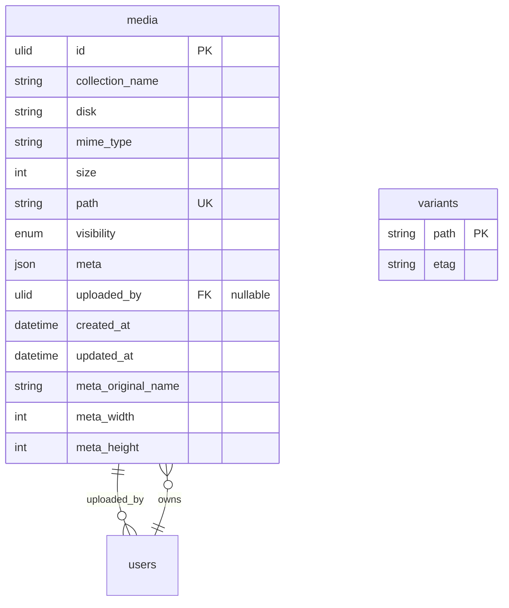
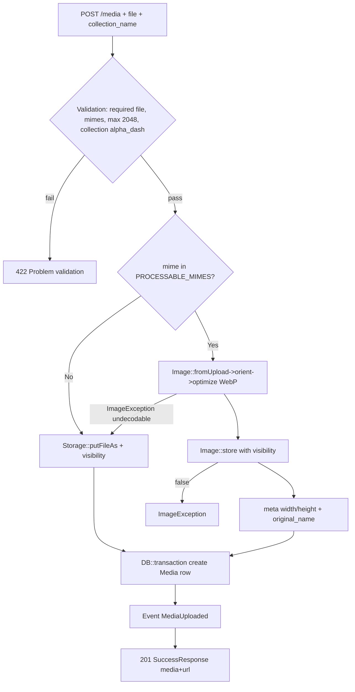
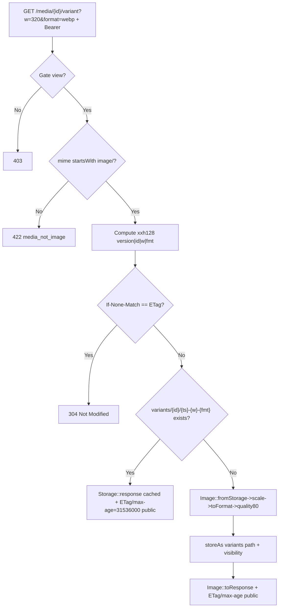
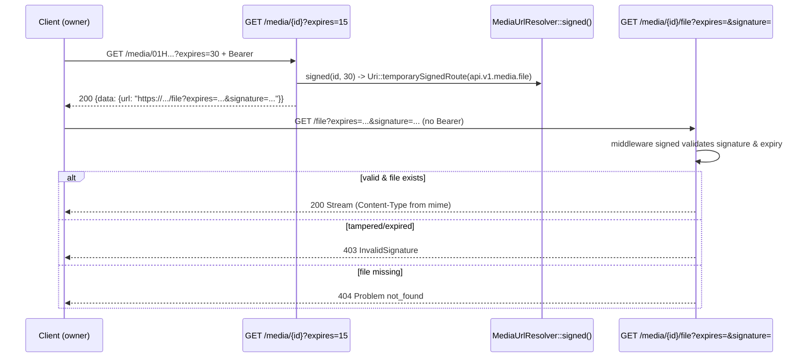
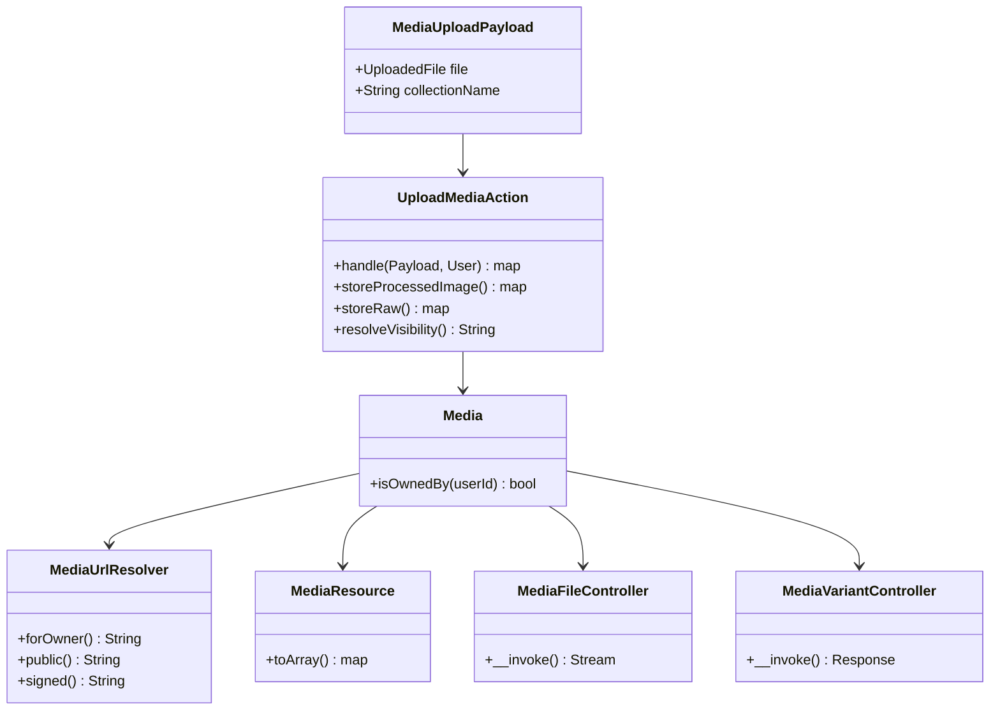

# Media Module — User-Uploaded Media Storage

> Lightweight custom module inspired by Spatie Media Library (no heavy dependency chain). Handles file uploads, first-party image processing (Intervention Image v4), on-the-fly variants with derived-file caching, and signed streaming for private files. Requires `IAM` (`module.json: requires ["IAM"]`).

## Setup

### Enable / Disable

```bash
php artisan module:enable Media
php artisan module:disable Media
php artisan module:list
```

`IAM` must be enabled first (dependency).

### Migrate & Seed

```bash
php artisan module:migrate Media
# IAMSeeder creates base roles/permissions including media.view/create for role 'user'
php artisan db:seed --class="Modules\IAM\Database\Seeders\IAMSeeder"
```

### Configuration

| Key | Default | Description |
|-----|---------|-------------|
| `media.disk` | `public` | Filesystem disk (`config/filesystems.php`). `public` uses `storage/app/public` + `url` `/storage`. Create symlink `php artisan storage:link`. |
| `media.max_size` | `2048` | Max upload KB |
| `media.mimes` | `['jpg','jpeg','png','webp','gif','bmp']` | Allowed extensions (validated via `mimes:` guessing from content) |
| `images.default` | `env('IMAGE_DRIVER','gd')` | `config/images.php` — image driver `gd` or `imagick` (requires PHP extension) |

Env for S3:
```env
MEDIA_DISK=s3
IMAGE_DRIVER=imagick
```

Visibility: `MediaVisibilityEnum` — `avatars` collection → `public`, others → `private`. Filesystem visibility set explicitly on `putFileAs`/`Image::store` so DB enum and filesystem stay consistent (see `UploadMediaAction`).

## Architecture

### ERD



### Flowchart — Upload



### Flowchart — Variant (resized)



### Flowchart — Signed Streaming (private)



### Schema — Layer Map



## Endpoints

Base `http://localhost:8000` — `api/v1/media` via `RouteServiceProvider` (`api.v1.media.*`). ULID constraint on `{media}`.

| Method | Path | Name | Middleware | Description |
|--------|------|------|------------|-------------|
| POST | `/media` | `api.v1.media.upload` | `auth:sanctum`, `active`, `throttle:api`, `permission:media.create` | Upload file (multipart `file` + optional `collection_name` alpha_dash max 50, default `default`) |
| GET | `/media` | `api.v1.media.index` | `auth:sanctum`, `active`, `throttle:api`, `permission:media.view` | List paginated, filterable via `MediaBuilder` |
| GET | `/media/{media}` | `api.v1.media.show` | `auth:sanctum`, `active`, `throttle:api` | Show one; `?expires=1..1440` swaps `url` for signed streaming link |
| GET | `/media/{media}/variant` | `api.v1.media.variant` | `auth:sanctum`, `active`, `throttle:api` | Resized variant: `?w=32..2000` required, `?format=webp|jpg` optional (default webp). Returns `image/webp`/`image/jpeg` with `ETag` + `max-age=31536000` public, `304` on `If-None-Match`, `422` if non-image |
| GET | `/media/{media}/file` | `api.v1.media.file` | `signed`, `throttle:api` | **Public** streaming via signed URL (signature is credential). No Bearer needed. `403` if tampered/expired, `404` if bytes missing |
| DELETE | `/media/{media}` | `api.v1.media.delete` | `auth:sanctum`, `active`, `throttle:api` | Delete (owner or `media.delete` permission); removes file + `variants/{id}/` dir, fires `MediaDeleted` |

Envelope: `SuccessResponse` / `ProblemResponse` RFC 9457 — see `docs/api-standard.md`. Binary variant/file are **outside** envelope (direct `image/*` stream) — intentional.

## cURL Examples

```bash
TOKEN="1|..."

# Upload to avatars (image -> auto WebP, public)
curl -X POST http://localhost:8000/api/v1/media \
  -H "Authorization: Bearer $TOKEN" \
  -F "file=@photo.jpg" \
  -F "collection_name=avatars"
# => 201 {"status":201,"data":{"media":{"id":"01H...","collection_name":"avatars","mime_type":"image/webp","size":12345,"visibility":"public","url":"http://localhost:8000/storage/avatars/...webp","original_name":"photo.jpg"},"url":"http://..."}}

# Upload private document
curl -X POST http://localhost:8000/api/v1/media \
  -H "Authorization: Bearer $TOKEN" \
  -F "file=@doc.pdf"
# collection defaults to "default" -> visibility private, url null in JSON

# List (filterable)
curl "http://localhost:8000/api/v1/media?filter[collection_name]=avatars&sort=-created_at" \
  -H "Authorization: Bearer $TOKEN"

# Show — private without expires (url null)
curl http://localhost:8000/api/v1/media/01H... -H "Authorization: Bearer $TOKEN"

# Show — with signed URL (owner)
curl "http://localhost:8000/api/v1/media/01H...?expires=30" -H "Authorization: Bearer $TOKEN"
# => {"data":{"url":"http://localhost:8000/api/v1/media/01H.../file?expires=...&signature=..."}}

# Variant — webp 320px (auth, returns image bytes)
curl "http://localhost:8000/api/v1/media/01H.../variant?w=320" \
  -H "Authorization: Bearer $TOKEN" --output thumb.webp

# Variant — jpg 640px with 304 cache
curl "http://localhost:8000/api/v1/media/01H.../variant?w=640&format=jpg" \
  -H "Authorization: Bearer $TOKEN" -D - --output thumb.jpg
# Second request with ETag:
curl "http://localhost:8000/api/v1/media/01H.../variant?w=640&format=jpg" \
  -H "Authorization: Bearer $TOKEN" -H 'If-None-Match: "abc..."' -i
# => 304 Not Modified

# Signed streaming — use URL from ?expires= (no Bearer)
SIGNED="http://localhost:8000/api/v1/media/01H.../file?expires=...&signature=..."
curl "$SIGNED" --output private.pdf

# Delete (also cleans variants/ dir)
curl -X DELETE http://localhost:8000/api/v1/media/01H... -H "Authorization: Bearer $TOKEN"
```

## Customize

- **New collection visibility:** Edit `UploadMediaAction::resolveVisibility()` — `avatars` → `Public`, rest `Private`. Add enum `MediaVisibilityEnum` handling if needed.
- **Image pipeline:** `UploadMediaAction::storeProcessedImage()` — change `orient()->optimize()` to `cover(400,400)` or `quality(60)`, add `when()` conditional. Config driver via `config/images.php` (`IMAGE_DRIVER=imagick`).
- **Add endpoint:** Controller `final readonly` invokable, `Action` `final readonly handle()`, `Payload::fromRequest()`, `Request` with `authorize()` + `rules()`, `Resource` with `FormatDate`, route in `routes/V1.php` under `api/v1` prefix.
- **Events:** `MediaUploaded` / `MediaDeleted` in `app/Events` — attach listener in `EventServiceProvider` (already scaffolded).
- **Policies:** `MediaPolicy::view/delete` via `#[UsePolicy]` on `Media` model — owner or `media.view/delete` permission.

## Testing

```bash
# All Media tests (63 tests)
php artisan test --filter="Media"
# Helpers: Storage::fake('public'), UploadedFile::fake()->image(), MediaFactory::new()->forUser($user)
# Assertions: Storage::assertExists($media->path), assertSuccessResponse(201), Event::fake([MediaUploaded::class])
```

Coverage: `MediaUploadTest` (WebP normalization, bmp, pdf passthrough), `MediaVariantTest` (cache hit, 304, jpg format, bounds), `MediaFileTest` (signed, tampered, expired), `MediaShowTest` (`?expires=`), `MediaDeleteTest` (variants cleanup), `MediaUrlResolverTest` (forOwner/public/signed).

## Related Docs

- [API Standard](../../docs/api-standard.md) — envelope shapes
- [Architecture](../../docs/architecture.md) — module anatomy
- [Rate Limiting](../../docs/rate-limiting.md) — global tiers (`api` 60/min for Media)
- ADRs: [0015 Media Storage](../../docs/adr/0015-media-storage-module.md), [0030 Custom Media](../../docs/adr/0030-custom-media-module.md), [0031 Image Processing](../../docs/adr/0031-first-party-image-processing.md), [0032 Signed+Events+Cache](../../docs/adr/0032-signed-media-events-cached-variants.md)
- Scramble OpenAPI: `http://localhost:8000/docs/api` (`config/scramble.php:23` `api_path='api'`)
